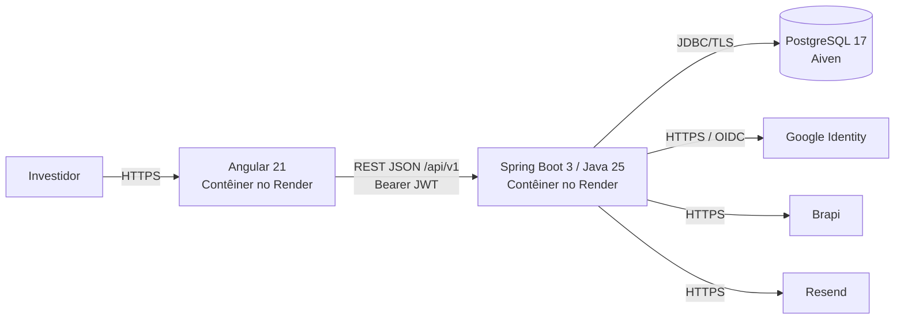

# Documento de Arquitetura do Sistema — MAD — Meus Ativos Digitais

> **Versão:** 1.0  
> **Última atualização:** 20/07/2026
> **Responsável:** Evandro Moreira  
> **Documento relacionado:** ERS — Especificação de Requisitos de Sistema

## 1. Introdução

### 1.1 Objetivo

Este documento descreve a arquitetura proposta para o MAD. Regras funcionais e financeiras permanecem no ERS e nas especificações de funcionalidade.

### 1.2 Documentos relacionados

- [Modelo de Dados](./modelo_dados.md)
- [Índice de ADRs](./adr/README.md)
- [Integração com API da Bolsa de Valores do Brasil](../integracoes/integracao_api_bolsa_brasil.md)
- [ERS](../requisitos/ers.md)
- [Escopo do MVP](../requisitos/escopo_mvp.md)

### 1.3 Estrutura da Documentação de Arquitetura

```text
docs/
├── arquitetura/
│   ├── documento_arquitetura_MAD.md   ← este documento (visão geral)
│   ├── modelo_dados.md                ← entidades, relacionamentos, diagrama ER
│   └── adr/
│       ├── README.md                  ← índice de todas as decisões
│       ├── adr-001-estilo-arquitetural.md
│       ├── adr-002-banco-de-dados.md
│       ├── adr-003-provedor-oauth.md
│       ├── adr-004-provedor-cotacoes.md
│       └── adr-005-estrategia-autenticacao.md
└── integracoes/
    └── integracao_api_bolsa_brasil.md ← contrato técnico da API de dados da bolsa brasileira
```

## 2. Visão Geral

### 2.1 Estilo arquitetural

O frontend e a API são aplicações independentes. A API adota monolito modular organizado por domínio, sem Spring Modulith. A decisão completa está no [ADR-001](./adr/adr-001-estilo-arquitetural.md).

### 2.2 Diagrama de contêineres



### 2.3 Responsabilidades

| Camada | Responsabilidade | Tecnologia |
| --- | --- | --- |
| Frontend | Interface responsiva, formulários e apresentação | Angular 21, TypeScript, PrimeNG, Tailwind CSS |
| API | Autenticação, autorização, regras de negócio e integrações | Java 25, Spring Boot 3, Spring Security |
| Persistência | Dados transacionais, posição materializada, auditoria e cotações | PostgreSQL 17 no Aiven, JPA/Hibernate, Flyway |
| Jobs | Catálogo de ativos e cotações diárias | Spring Scheduler e trava no PostgreSQL |
| Externos | Identidade, e-mail e dados da bolsa brasileira | Google OIDC, Resend e Brapi |

## 3. Stack Tecnológica

### 3.1 Frontend

- Angular 21 LTS e Node.js 24 LTS.
- Standalone components, services e Signals; NgRx não será utilizado.
- Reactive Forms; template-driven forms não serão utilizados.
- PrimeNG para componentes e Tailwind CSS para layout.
- Chart.js e ng2-charts permanecem disponíveis, mas gráficos não integram o MVP.
- Interceptor para `Authorization: Bearer` e renovação controlada de sessão.
- Guards controlam navegação; a autorização efetiva pertence à API.
- Aplicação compilada e servida por contêiner Docker no Render.

### 3.2 Backend

- Java 25 LTS, Spring Boot 3, Spring Security, Spring Data JPA/Hibernate e Flyway.
- API REST JSON versionada sob `/api/v1` e documentada por OpenAPI.
- Organização `Controller -> Service -> Repository`, com DTOs separados das entidades.
- Módulos por domínio, sem dependência do Spring Modulith.
- Bean Validation na borda e validações financeiras no serviço de domínio.
- `java.math.BigDecimal` para dinheiro, quantidades, fatores e percentuais; `double` e `float` são proibidos nesses valores.

### 3.3 Persistência

- PostgreSQL 17, uma instância Aiven isolada para cada ambiente, priorizando estabilidade e compatibilidade com o Flyway adotado pelo projeto.
- UUID para chaves primárias.
- `NUMERIC(19,8)` para dinheiro e quantidade; `NUMERIC(19,10)` para fatores e percentuais.
- Valores BRL são arredondados para duas casas apenas na resposta e exibição.
- Exclusão física, respeitando confirmação explícita e cascatas previstas no ERS.
- Auditoria imutável de criação, alteração e exclusão, sem segredos.
- Migrações versionadas pelo Flyway.
- Detalhes no [modelo de dados](./modelo_dados.md) e [ADR-002](./adr/adr-002-banco-de-dados.md).

### 3.4 Posição materializada

`posicao_ativo` mantém quantidade atual e Custo Total por carteira e ativo. Ela é uma projeção transacional reconstruível a partir do histórico e nunca contém preço médio.

- compra e subscrição aumentam quantidade e Custo Total;
- venda reduz quantidade e o Custo Total proporcionalmente à posição imediatamente anterior;
- bonificação aumenta apenas quantidade;
- desdobramento e grupamento substituem apenas quantidade;
- criação, alteração ou exclusão retroativa exige reprocessamento cronológico do par carteira/ativo na mesma transação;
- bloqueio pessimista ou controle de versão impede atualizações concorrentes perdidas.

### 3.5 Cache e processamento assíncrono

- Não haverá Redis nem broker de mensagens no MVP.
- Cache local poderá ser usado apenas para dados auxiliares da Brapi, com validade configurável.
- Jobs executam via Spring Scheduler com trava distribuída persistida no PostgreSQL.

## 4. Integrações

### 4.1 Dados da Bolsa de Valores do Brasil

A Brapi é acessada exclusivamente pela API. O token fica em `BRAPI_TOKEN`. A integração mantém o catálogo de Ações e FIIs e atualiza diariamente as cotações somente dos ativos referenciados em carteiras de usuários. O contrato consta em [integracao_api_bolsa_brasil.md](../integracoes/integracao_api_bolsa_brasil.md).

### 4.2 E-mail

- Provedor: Resend.
- Capacidade de referência inicial: 500 e-mails transacionais por mês para 50 usuários.
- Remetente: variável `EMAIL_FROM`.
- Casos: confirmação de cadastro e recuperação de senha.
- Templates versionados no backend.

### 4.3 Google OIDC

O backend usa Spring Security OAuth2 Client. Somente contas com e-mail verificado podem ser criadas ou vinculadas. Ver [ADR-003](./adr/adr-003-provedor-oauth.md).

## 5. Segurança

- Todos os endpoints, exceto `/api/v1/auth/*`, exigem Bearer JWT.
- Access token JWT de 15 minutos mantido apenas em memória no frontend.
- Refresh token opaco com 7 dias, em cookie `HttpOnly`, `Secure` e política `SameSite` configurada conforme os domínios.
- Refresh tokens têm rotação; somente o hash é persistido.
- Logout, troca de senha e exclusão da conta revogam refresh tokens.
- Senhas usam Argon2id com parâmetros definidos e revisados na implementação.
- Tokens de confirmação e recuperação são aleatórios, de uso único e persistidos somente como hash; recuperação expira em 30 minutos.
- CORS é restrito por ambiente; o endpoint de refresh recebe proteção CSRF.
- TLS mínimo 1.2.
- Login, recuperação e refresh recebem rate limiting.
- Toda consulta de dados do investidor filtra e valida `usuario_id` no serviço e repositório.
- Segredos são injetados por variáveis de ambiente e nunca registrados em logs.
- Endpoint de exclusão definitiva de conta que remove dados pessoais e financeiros; auditoria técnica retida deve anonimizar a identidade.

## 6. Desempenho e Escalabilidade

- Índices compostos cobrem proprietário, carteira, ativo e data.
- A posição materializada evita reprocessar todo o histórico nas consultas do dashboard.
- Alterações retroativas pagam o custo de reconstrução somente do par carteira/ativo afetado.
- Backend sem estado de sessão local permite múltiplas réplicas.
- Jobs usam trava distribuída para impedir execução duplicada.
- Consultas serão verificadas contra o limite de 3 segundos com 50 ativos e 1.000 operações por carteira.

## 7. Infraestrutura e Entrega

### 7.1 Ambientes

| Ambiente | Frontend | Backend | Banco |
| --- | --- | --- | --- |
| Desenvolvimento | Contêiner Docker/local | Contêiner Docker/local | Aiven dedicado |
| Homologação | Contêiner no Render | Contêiner separado no Render | Aiven dedicado |
| Produção | Contêiner no Render | Contêiner separado no Render | Aiven dedicado |

URLs são fornecidas por variáveis de ambiente e não constam como valores fixos no repositório.

### 7.2 CI/CD

- GitHub Actions executa lint, testes, build, validação do OpenAPI e migrações.
- Homologação recebe deploy automático após sucesso do pipeline.
- Produção exige aprovação manual.
- Frontend e backend têm imagens e ciclos de deploy independentes.
- Spring Boot Actuator fornece health checks necessários à plataforma.

### 7.3 Backup e recuperação

**Decisão pendente para etapa posterior ao término do desenvolvimento.** Antes da entrada em produção deverá ser definida e validada uma solução que cumpra o RNF-014: backup diário automatizado, retenção mínima de 30 dias e teste periódico de restauração. Enquanto isso, o RNF-014 não pode ser considerado atendido.

## 8. Observabilidade

**Decisão pendente para etapa posterior ao término do desenvolvimento.** A definição futura deverá cobrir logs, métricas, rastreamento de erros, disponibilidade, alertas e retenção, sem expor dados financeiros ou segredos. Enquanto isso, RNF-008 e a monitoração operacional de RNF-007/RNF-015 não podem ser considerados integralmente atendidos.

## 9. Estratégia de Testes

- Backend: JUnit 5, Mockito, Spring Boot Test e Testcontainers com PostgreSQL.
- Frontend: Vitest e Angular Testing Library.
- E2E: Playwright.
- Testes de contrato validam a implementação contra o OpenAPI.
- Cobertura mínima global de 80% em frontend e backend.
- O pipeline executa testes de integração com PostgreSQL em contêiner.
- Casos financeiros cobrem lançamentos retroativos, reconstrução da posição, concorrência e precisão decimal.

## 10. Rastreabilidade

| Área | Requisitos |
| --- | --- |
| Autenticação | RF-001 a RF-005, RNF-002 a RNF-005, RN-011 |
| Persistência e auditoria | RF-006 a RF-026, RNF-012, RNF-013, RN-001 a RN-009, RN-012 |
| Dashboard e posição | RF-027 a RF-040, RNF-007, RN-010, RN-013 a RN-018 |
| Catálogo de ativos e cotações | RF-034, RF-041 a RF-044, RNF-015, RN-008, RN-017, RN-018 |
| Infraestrutura | RNF-008, RNF-009, RNF-014, RNF-017 |

## 11. Decisões Arquiteturais (ADRs)

Todas as decisões arquiteturais significativas — com contexto, alternativas avaliadas e consequências — ficam registradas individualmente em [`docs/arquitetura/adr/`](./adr/README.md).

| ADR | Título |
| --- | --- |
| [001](./adr/adr-001-estilo-arquitetural.md) | Estilo Arquitetural do Sistema (Monolito Modular) |
| [002](./adr/adr-002-banco-de-dados.md) | Banco de Dados e Persistência (PostgreSQL 17 / Aiven) |
| [003](./adr/adr-003-provedor-oauth.md) | Login Social (Spring Security OAuth2 Client + Google) |
| [004](./adr/adr-004-provedor-cotacoes.md) | Provedor de Dados da Bolsa de Valores do Brasil (Brapi.dev, plano gratuito) |
| [005](./adr/adr-005-estrategia-autenticacao.md) | Autenticação (JWT + Argon2) |

Ao tomar uma nova decisão arquitetural relevante (ex.: escolha do provedor de e-mail transacional — ADR-006 em aberto, ver seção 4.2), criar um novo ADR seguindo o mesmo padrão e atualizar o índice em [`adr/README.md`](./adr/README.md).

## 12. Histórico

| Versão | Data | Autor | Alteração |
| --- | --- | --- | --- |
| 1.1 | 07/07/2026 | Evandro Moreira | Revisão e alterações |
| 1.0 | 06/07/2026 | Evandro Moreira | Arquitetura inicial proposta |
