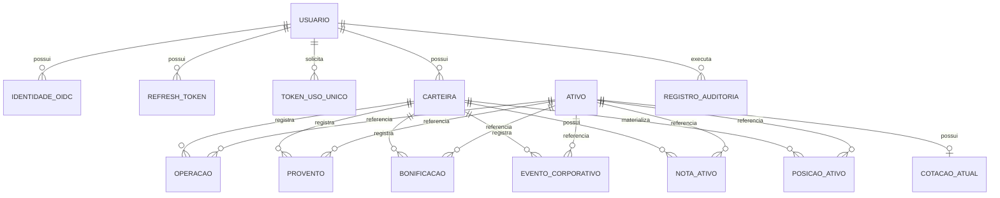

# Modelo de Dados — MAD — Meus Ativos Digitais

> **Status:** Proposto  
> **Versão:** 1.0  
> **Data:** 06/07/2026  
> **Responsável:** Evandro Moreira

## 1. Objetivo

Definir o modelo relacional necessário ao MVP. Nomes SQL usam `snake_case`, chaves primárias usam UUID e horários são persistidos com fuso (`timestamptz`).

## 2. Diagrama

## 3. Convenções

- Dinheiro e quantidade: `numeric(19,8)`.
- Fatores e percentuais: `numeric(19,10)`.
- Valores monetários são mapeados para `BigDecimal`.
- Restrições `check` impedem quantidades negativas e valores fora dos limites definidos nas ESPECs.
- Campos `created_at` e `updated_at` usam `timestamptz`.
- Entidades com concorrência de escrita possuem `version bigint` para optimistic locking.
- Nenhuma coluna representa preço médio.

## 4. Tabelas

### 4.1 Identidade e autenticação

#### `usuario`

| Coluna | Tipo | Regra |
| --- | --- | --- |
| `id` | `uuid` | PK |
| `nome` | `varchar(150)` | obrigatório |
| `email` | `varchar(320)` | obrigatório, normalizado e único |
| `senha_hash` | `varchar(255)` | nulo para conta exclusivamente OIDC |
| `email_verificado_at` | `timestamptz` | nulo enquanto não confirmado |
| `created_at`, `updated_at` | `timestamptz` | obrigatórios |
| `version` | `bigint` | controle concorrente |

#### `identidade_oidc`

| Coluna | Tipo | Regra |
| --- | --- | --- |
| `id`, `usuario_id` | `uuid` | PK e FK |
| `issuer` | `varchar(255)` | obrigatório |
| `subject` | `varchar(255)` | obrigatório |
| `email_verificado` | `varchar(320)` | e-mail recebido e verificado |
| `created_at`, `updated_at` | `timestamptz` | auditoria temporal |

Restrição única: (`issuer`, `subject`).

#### `refresh_token`

Contém `id`, `usuario_id`, `familia_id`, `token_hash`, `expires_at`, `revoked_at`, `replaced_by_id`, `created_at` e metadados técnicos mínimos. `token_hash` é único; o token puro nunca é persistido.

#### `token_uso_unico`

Contém `id`, `usuario_id`, `tipo` (`CONFIRMACAO_EMAIL` ou `RECUPERACAO_SENHA`), `token_hash`, `expires_at`, `used_at` e `created_at`.

### 4.2 Carteira e ativos

#### `carteira`

`id`, `usuario_id`, `nome`, `created_at`, `updated_at` e `version`. Restrição única: (`usuario_id`, `nome`).

#### `ativo`

| Coluna | Tipo | Regra |
| --- | --- | --- |
| `id` | `uuid` | PK |
| `ticker` | `varchar(20)` | único e obrigatório |
| `nome` | `varchar(255)` | obrigatório |
| `categoria` | `varchar(10)` | `ACAO` ou `FII` |
| `disponivel_selecao` | `boolean` | disponibilidade cadastral para novas seleções |
| `status_negociacao` | `varchar(40)` | status informado ou derivado do provedor, quando disponível |
| `provedor` | `varchar(40)` | provedor responsável pela sincronização cadastral |
| `ultima_sincronizacao_at` | `timestamptz` | última sincronização bem-sucedida do item no catálogo |
| `created_at`, `updated_at` | `timestamptz` | obrigatórios |

O ativo é mantido pela integração externa, não cadastrado livremente pelo usuário. Ativos que deixam de estar disponíveis no provedor não devem ser excluídos fisicamente; nesses casos, devem ser marcados como indisponíveis para novas seleções.

### 4.3 Lançamentos financeiros

#### `operacao`

| Coluna | Tipo | Regra |
| --- | --- | --- |
| `id`, `carteira_id`, `ativo_id` | `uuid` | PK e FKs |
| `tipo` | `varchar(20)` | `COMPRA`, `VENDA` ou `SUBSCRICAO` |
| `data_operacao` | `date` | obrigatório |
| `quantidade` | `numeric(19,8)` | maior que zero |
| `preco_unitario` | `numeric(19,8)` | opcional e informativo |
| `taxas` | `numeric(19,8)` | opcional e informativo |
| `valor_total` | `numeric(19,8)` | Custo Total para compra/subscrição; valor da operação para venda |
| `created_at`, `updated_at` | `timestamptz` | obrigatórios |
| `version` | `bigint` | controle concorrente |

`preco_unitario` e `taxas` não são usados para recalcular `valor_total`.

#### `provento`

`id`, `carteira_id`, `ativo_id`, `tipo` (`DIVIDENDO` ou `JCP`), `data_pagamento`, `valor_por_unidade` opcional, `valor_total` informado pelo usuário, `created_at`, `updated_at` e `version`.

#### `bonificacao`

`id`, `carteira_id`, `ativo_id`, `data_evento`, `quantidade_recebida`, `descricao`, `created_at`, `updated_at` e `version`. Não altera Custo Total.

#### `evento_corporativo`

`id`, `carteira_id`, `ativo_id`, `tipo` (`DESDOBRAMENTO` ou `GRUPAMENTO`), `data_evento`, `fator_numerador`, `fator_denominador`, `nova_quantidade_total`, `descricao`, `created_at`, `updated_at` e `version`. O evento substitui a quantidade e não altera Custo Total.

#### `nota_ativo`

`id`, `carteira_id`, `ativo_id`, `conteudo`, `created_at`, `updated_at` e `version`.

### 4.4 Posição materializada

#### `posicao_ativo`

| Coluna | Tipo | Regra |
| --- | --- | --- |
| `id` | `uuid` | PK |
| `carteira_id`, `ativo_id` | `uuid` | FKs; combinação única |
| `quantidade_atual` | `numeric(19,8)` | maior ou igual a zero |
| `custo_total` | `numeric(19,8)` | maior ou igual a zero |
| `ultima_data_processada` | `date` | rastreabilidade da projeção |
| `updated_at` | `timestamptz` | obrigatório |
| `version` | `bigint` | concorrência |

Regras de manutenção:

1. Todo lançamento que afeta posição é persistido junto da atualização da projeção em uma única transação.
2. Alterações retroativas reconstroem a projeção em ordem por data e critério determinístico de desempate.
3. Venda superior à quantidade histórica disponível aborta toda a transação.
4. A redução de Custo Total na venda é proporcional à quantidade vendida sobre a quantidade anterior, mantendo precisão integral durante o cálculo.
5. Quando a quantidade chega a zero, o Custo Total deve resultar em zero; ajustes de escala nunca produzem preço médio persistido.

### 4.5 Cotações

#### `cotacao_atual`

Uma linha por ativo: `id`, `ativo_id` único, `preco numeric(19,8)`, `moeda`, `data_referencia`, `obtida_at`, `provedor` e `updated_at`. Somente uma resposta válida substitui a anterior.

O MVP não armazena histórico de cotações nem snapshot mensal de preço. A evolução do custo de aquisição deve ser calculada a partir dos lançamentos históricos e da reconstrução da posição por competência, sem utilizar cotações históricas.

### 4.6 Auditoria

#### `registro_auditoria`

| Coluna | Tipo | Regra |
| --- | --- | --- |
| `id` | `uuid` | PK |
| `usuario_id` | `uuid` | opcional; anonimizado na exclusão da conta |
| `entidade_tipo` | `varchar(80)` | obrigatório |
| `entidade_id` | `uuid` | identificador técnico |
| `operacao` | `varchar(10)` | `CREATE`, `UPDATE`, `DELETE` |
| `estado_anterior`, `estado_novo` | `jsonb` | versões saneadas aplicáveis |
| `ocorrido_at` | `timestamptz` | obrigatório |
| `correlation_id` | `uuid` | correlação técnica |

A auditoria é append-only e não armazena senha, token, segredo nem conteúdo pessoal desnecessário.

## 5. Integridade e exclusão

- FKs impedem registros órfãos.
- Exclusão confirmada de carteira remove fisicamente seus lançamentos, notas e posição na mesma transação.
- Exclusão de conta remove identidades, tokens, carteiras e dados financeiros; o vínculo de auditoria é anonimizado.
- Ativo com vínculos não pode ser removido sem o fluxo explícito previsto no ERS.
- O serviço valida propriedade antes de consultar ou alterar qualquer agregado.

## 6. Índices mínimos

- `carteira(usuario_id, nome)` único.
- `ativo(ticker)` único.
- `ativo(categoria, disponivel_selecao)` para busca de ativos elegíveis por categoria.
- Lançamentos: `(carteira_id, ativo_id, data_*)`.
- Históricos: `(carteira_id, data_*)`.
- `posicao_ativo(carteira_id, ativo_id)` único.
- `registro_auditoria(entidade_tipo, entidade_id, ocorrido_at)`.
- `refresh_token(usuario_id, familia_id)` e `token_uso_unico(token_hash)`.

Índices adicionais dependem de medição das consultas reais; não devem ser criados sem consulta correspondente.

## 7. Migrações e validação

- Flyway é a única forma de alterar schema em ambientes compartilhados.
- Migrações aplicadas não são editadas.
- CI valida migrações do zero e atualização a partir da versão anterior.
- Testes com Testcontainers verificam constraints, cascatas, concorrência e reconstrução da posição.

## 8. Referências

- [ERS](../requisitos/ers.md)
- [ADR-002](./adr/adr-002-banco-de-dados.md)
