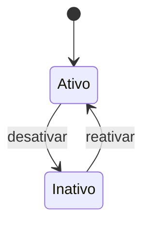
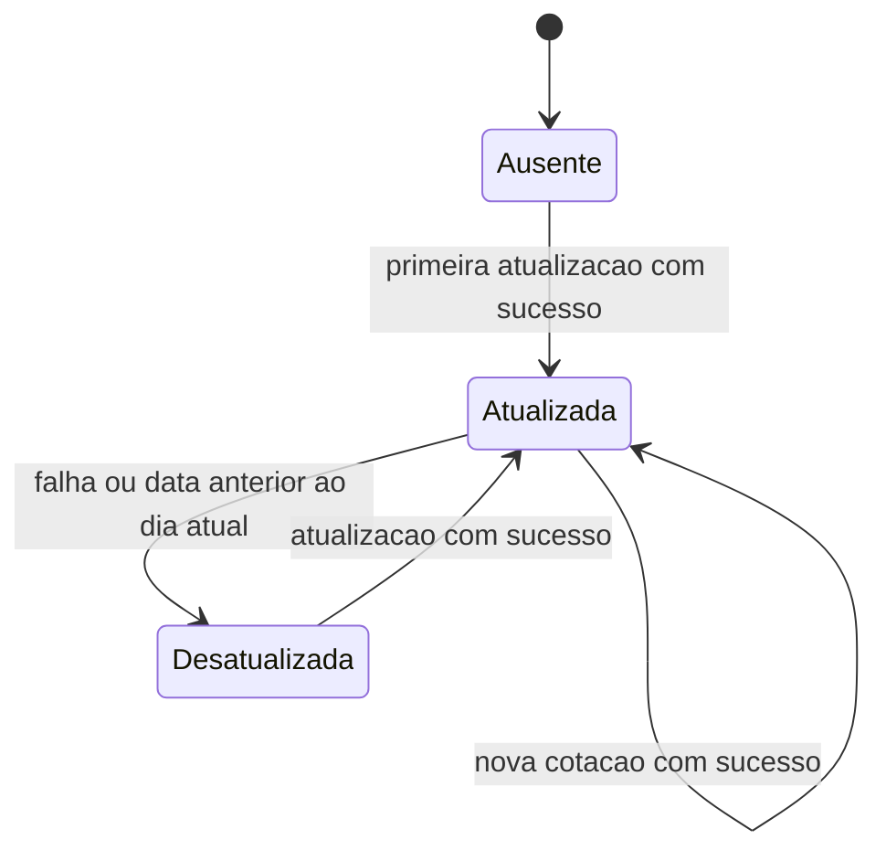
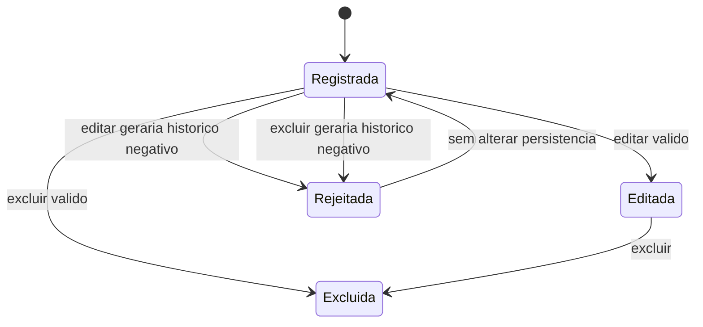
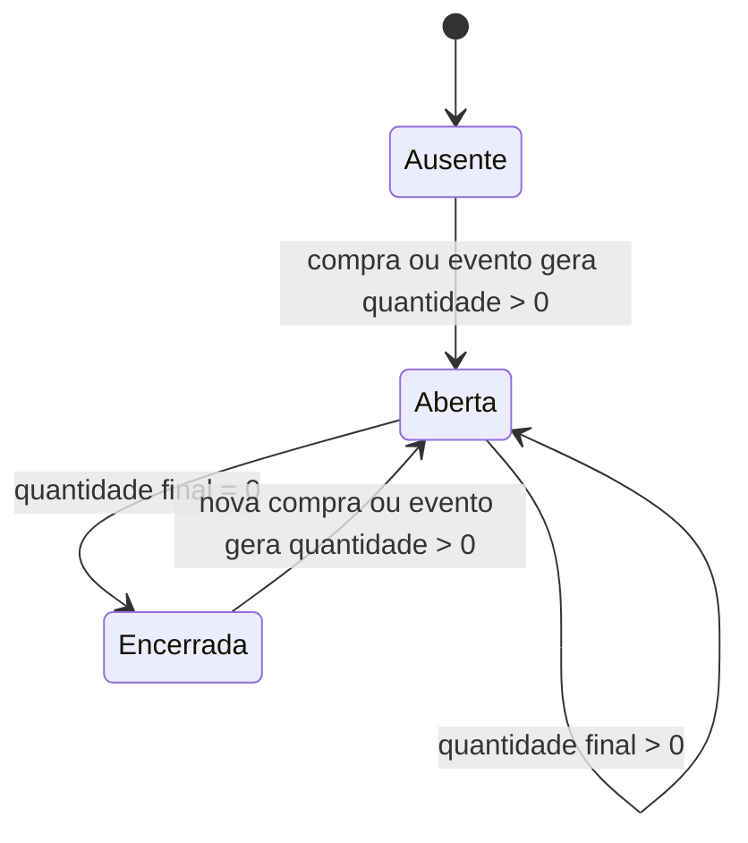

# State Transitions

## Ativo

```mermaid
stateDiagram-v2
    [*] --> Ativo
    Ativo --> Inativo: desativar
    Inativo --> Ativo: reativar
```

## CotacaoAtual

```mermaid
stateDiagram-v2
    [*] --> Ausente
    Ausente --> Atualizada: primeira atualizacao com sucesso
    Atualizada --> Atualizada: nova cotacao com sucesso
    Atualizada --> Desatualizada: falha ou data anterior ao dia atual
    Desatualizada --> Atualizada: atualizacao com sucesso
```

## Operacao

```mermaid
stateDiagram-v2
    [*] --> Registrada
    Registrada --> Editada: editar valido
    Registrada --> Rejeitada: editar geraria historico negativo
    Registrada --> Excluida: excluir valido
    Registrada --> Rejeitada: excluir geraria historico negativo
    Editada --> Excluida: excluir
    Rejeitada --> Registrada: sem alterar persistencia
```

## EventoCorporativo

```mermaid
stateDiagram-v2
    [*] --> Registrado
    Registrado --> Editado: editar valido
    Registrado --> Rejeitado: editar geraria historico negativo
    Registrado --> Excluido: excluir valido
    Registrado --> Rejeitado: excluir geraria historico negativo
    Editado --> Excluido: excluir
    Rejeitado --> Registrado: sem alterar persistencia
```

## Posicao Calculada

```mermaid
stateDiagram-v2
    [*] --> Ausente
    Ausente --> Aberta: compra ou evento gera quantidade > 0
    Aberta --> Aberta: quantidade final > 0
    Aberta --> Encerrada: quantidade final = 0
    Encerrada --> Aberta: nova compra ou evento gera quantidade > 0
```
