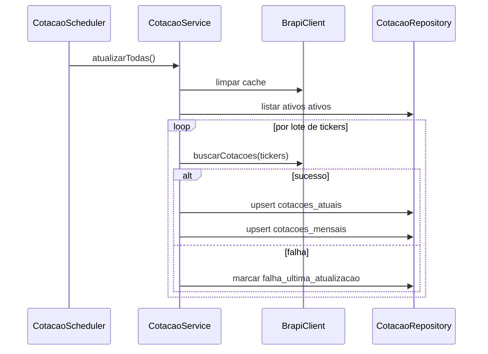

# Sequencia - Atualizacao de Cotacao

```mermaid
sequenceDiagram
    participant Scheduler as CotacaoScheduler
    participant Service as CotacaoService
    participant Brapi as BrapiClient
    participant Repo as CotacaoRepository

    Scheduler->>Service: atualizarTodas()
    Service->>Brapi: limpar cache
    Service->>Repo: listar ativos ativos
    loop por lote de tickers
        Service->>Brapi: buscarCotacoes(tickers)
        alt sucesso
            Service->>Repo: upsert cotacoes_atuais
            Service->>Repo: upsert cotacoes_mensais
        else falha
            Service->>Repo: marcar falha_ultima_atualizacao
        end
    end
```

