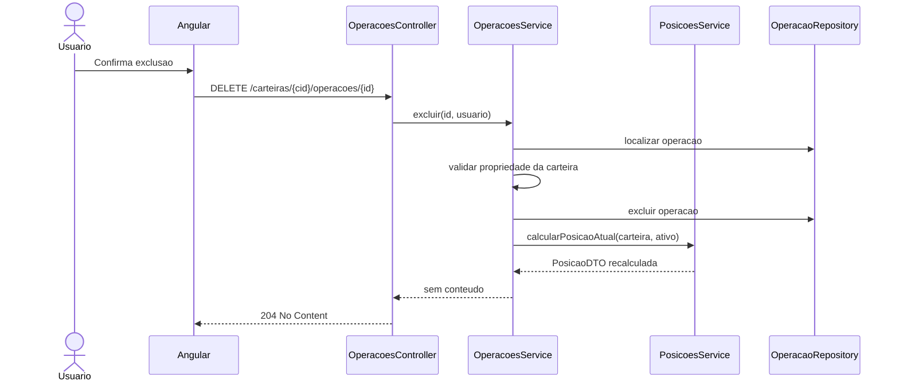

# Sequencia - Exclusao de Operacao

```mermaid
sequenceDiagram
    actor U as Usuario
    participant F as Angular
    participant C as OperacoesController
    participant S as OperacoesService
    participant P as PosicoesService
    participant R as OperacaoRepository

    U->>F: Confirma exclusao
    F->>C: DELETE /carteiras/{cid}/operacoes/{id}
    C->>S: excluir(id, usuario)
    S->>R: localizar operacao
    S->>S: validar propriedade da carteira
    S->>R: excluir operacao
    S->>P: calcularPosicaoAtual(carteira, ativo)
    P-->>S: PosicaoDTO recalculada
    S-->>C: sem conteudo
    C-->>F: 204 No Content
```

