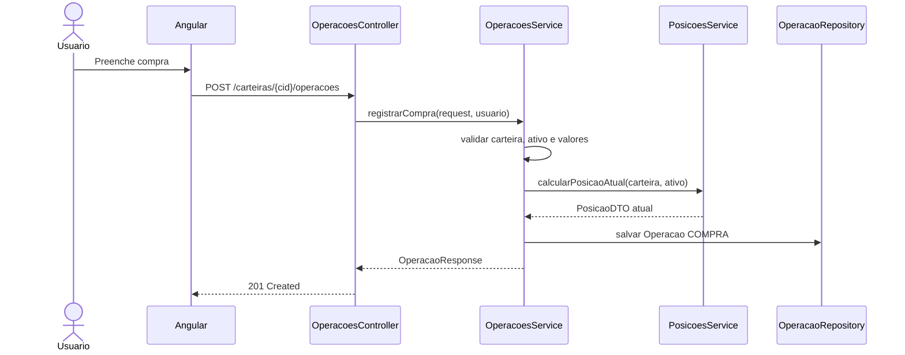

# Sequencia - Nova Compra

```mermaid
sequenceDiagram
    actor U as Usuario
    participant F as Angular
    participant C as OperacoesController
    participant S as OperacoesService
    participant P as PosicoesService
    participant R as OperacaoRepository

    U->>F: Preenche compra
    F->>C: POST /carteiras/{cid}/operacoes
    C->>S: registrarCompra(request, usuario)
    S->>S: validar carteira, ativo e valores
    S->>P: calcularPosicaoAtual(carteira, ativo)
    P-->>S: PosicaoDTO atual
    S->>R: salvar Operacao COMPRA
    S-->>C: OperacaoResponse
    C-->>F: 201 Created
```

