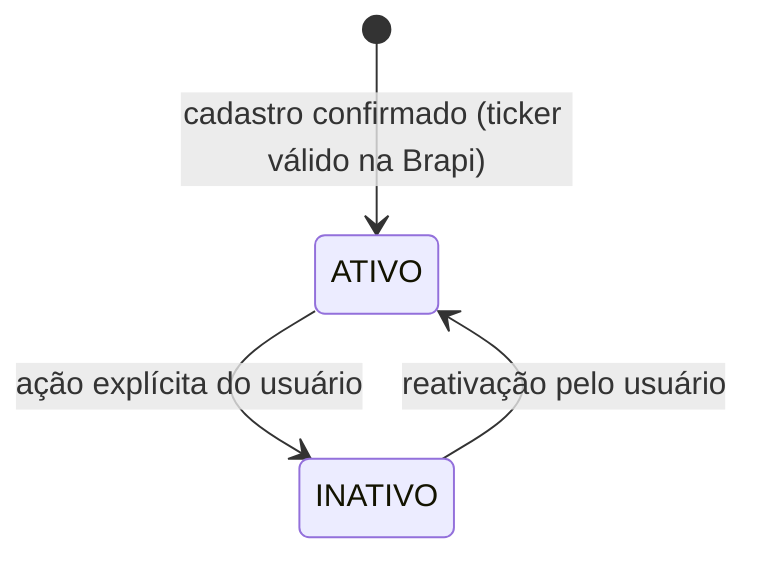
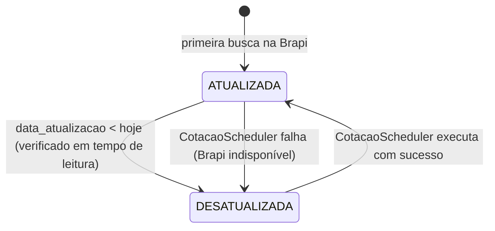
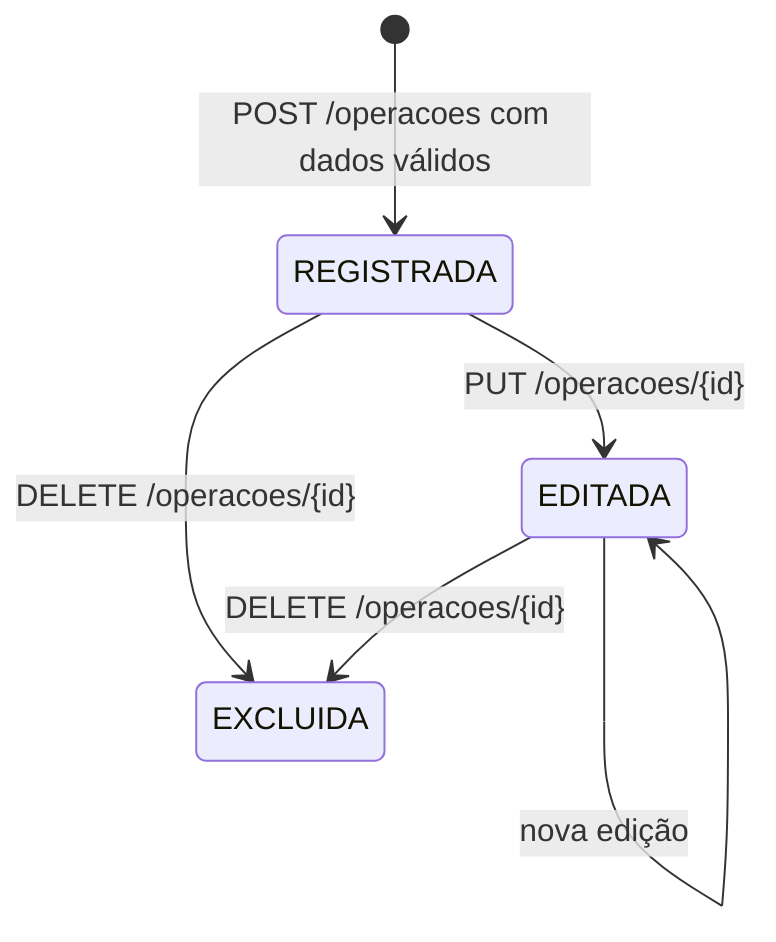
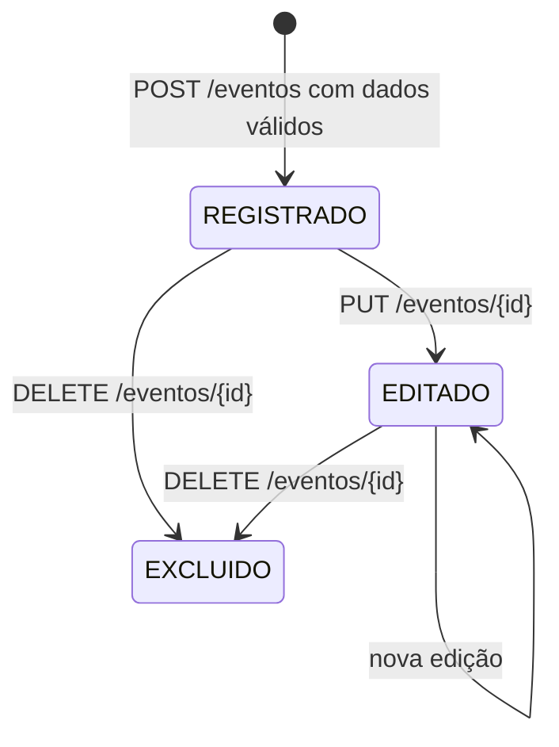
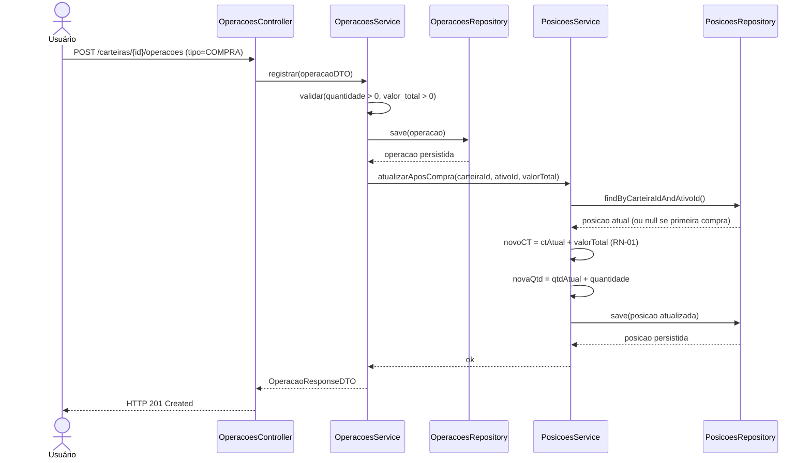
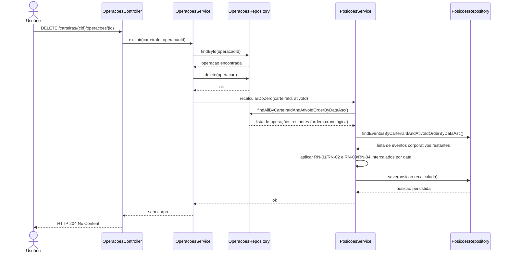

# Plano de Desenvolvimento SDD com IA
## Sistema de Gestão de Investimentos em Ações e FIIs
### Specification-Driven Development com Codex / GitHub Copilot

> **Versão:** 1.9 | **Data:** Junho de 2026 | **Base:** PRD v1.0 | **Revisão:** v1.1–v1.8 (ver rodapé) · v1.9 Posição Calculada sob Demanda + Cache HTTP

---

## Índice

1. [O que é SDD com IA e por que usar](#1-o-que-é-sdd-com-ia-e-por-que-usar)
2. [Visão geral do fluxo de trabalho](#2-visão-geral-do-fluxo-de-trabalho)
3. [Fase 0 — Setup e Infraestrutura](#3-fase-0--setup-e-infraestrutura)
4. [Fase 1 — MVP (8–12 semanas)](#4-fase-1--mvp-812-semanas)
5. [Fase 2 — Consolidação](#5-fase-2--consolidação-46-semanas-após-mvp)
6. [Fluxo de trabalho diário com Codex](#6-fluxo-de-trabalho-diário-com-codex)
7. [Checklist mestre de artefatos](#7-checklist-mestre-de-artefatos)
8. [Boas práticas e armadilhas comuns](#8-boas-práticas-e-armadilhas-comuns)

---

## 1. O que é SDD com IA e por que usar

Specification-Driven Development (SDD) é uma abordagem onde você escreve especificações precisas **antes** de gerar código — e usa essas especificações como entrada para ferramentas de IA (Codex, GitHub Copilot, Claude) produzirem implementações corretas e consistentes.

No contexto deste sistema (Ações e FIIs), o SDD resolve três problemas críticos:

- **Cálculos financeiros sensíveis** (Custo Total, P&L): a IA só gera código correto se as fórmulas e regras estiverem explicitamente documentadas.
- **Regras de negócio complexas** (eventos corporativos, splits): sem spec, a IA inventa comportamentos plausíveis mas errados.
- **Consistência entre frontend Angular e backend Spring Boot**: specs compartilhadas garantem que os dois lados falem a mesma linguagem.

**O ciclo básico do SDD com IA:**

1. Escrever a spec (este documento + artefatos complementares)
2. Alimentar a spec ao Codex / Copilot como contexto (via `AGENTS.md`, comentários, ou prompt direto)
3. Revisar o código gerado **contra a spec**
4. Atualizar a spec quando descobrir casos não cobertos

---

## 2. Visão Geral do Fluxo de Trabalho

| Artefato / Documento | Serve de entrada para |
|---|---|
| PRD (já existente) | Todos os demais documentos |
| `AGENTS.md` | Codex — instrui o agente de IA sobre o projeto |
| Schemas SQL / ERD | Migrations Flyway, testes de repositório, seeds |
| Contratos de API (OpenAPI) | Geração de controllers, DTOs, serviços Angular |
| Specs de Regras de Negócio | Serviços Java, testes unitários JUnit |
| Cenários de Teste (BDD / tabelas) | Testes JUnit, Jasmine, testes de integração |
| Wireframes / Spec de UI | Componentes Angular, templates PrimeNG |

---

## 3. Fase 0 — Setup e Infraestrutura

### 3.1 Documentos a Produzir

---

#### DOC-01: `AGENTS.md` (raiz do repositório)

> **Objetivo:** Arquivo lido automaticamente pelo Codex CLI antes de cada sessão. Define contexto, stack, convenções e regras inegociáveis.

**Conteúdo mínimo:**

- Nome e objetivo do projeto em 3 linhas
- Stack: Angular 21 LTS + Node.js 24 LTS + TypeScript | Spring Boot 3 + Java 25 LTS | PostgreSQL 18 | Brapi
- Estrutura de pastas (frontend e backend)
- Convenções de nomenclatura (camelCase TS, snake_case SQL, PascalCase Java)
- Regras inegociáveis: nunca calcular PM, sempre usar Custo Total; arredondar para 2 casas BRL
- Como rodar localmente: `docker-compose up`
- Como rodar testes: `npm test` (frontend) | `mvn test` (backend)
- Onde ficam os contratos de API: `/docs/api/`
- Referência ao modelo de dados: `/docs/schema.sql`
- Referência ao modelo de domínio: `/docs/domain/domain-model.md` — **leitura obrigatória antes de gerar qualquer Service ou Entity** _(adicionado v1.2)_
- Referência às transições de estado: `/docs/domain/state-transitions.md` — **consultar antes de gerar qualquer lógica condicional baseada em status ou estado** _(adicionado v1.3)_
- Referência aos diagramas de sequência: `/docs/sequences/` — **consultar antes de gerar serviços que envolvam múltiplas camadas ou chamadas entre serviços** _(adicionado v1.4)_
- Referência ao catálogo de erros: `/docs/api/error-catalog.md` — **toda exceção lançada deve corresponder a um ERR-XXX do catálogo; mensagens nunca inventadas** _(adicionado v1.5)_
- Referência aos testes de aceitação: `/docs/tests/acceptance-tests.feature` — **verdade absoluta do comportamento esperado do sistema; os cenários Gherkin têm precedência sobre qualquer outra interpretação** _(adicionado v1.6)_
- Referência à arquitetura frontend: `/docs/frontend/frontend-architecture.md` — **leitura obrigatória antes de gerar qualquer componente, serviço ou gerenciamento de estado Angular** _(adicionado v1.7)_
- Referência à arquitetura backend: `/docs/backend/backend-architecture.md` — **leitura obrigatória antes de gerar qualquer Controller, Service, Repository ou DTO Java** _(adicionado v1.8)_

**⚠️ Regras de segurança de segredos (obrigatórias):** _(adicionado v1.1)_

- `BRAPI_TOKEN`, `JWT_SECRET` e credenciais de banco **nunca** podem aparecer como valores literais no código
- No Java, sempre usar `System.getenv("NOME_VAR")` ou `@Value("${nome.var}")`
- No Angular, sempre usar `environment.ts` que lê de variáveis de build — nunca hardcodar tokens
- Exemplos **proibidos** que o Codex não deve gerar:
  ```java
  // PROIBIDO
  String token = "meu-token-brapi-123";
  String secret = "minha-chave-jwt";
  ```
- `BrapiClient` nunca deve gerar cache de valor de segredo — apenas cache de cotações
- Nunca chamar `BrapiClient` diretamente em loops; verificar `CotacaoAtual` antes de qualquer chamada externa

---

#### DOC-02: `schema.sql` — Modelo de Dados Completo

> **Objetivo:** SQL DDL completo e anotado de todas as tabelas, índices e constraints.

**Tabelas a definir (extraídas do PRD seção 9):**

- `usuarios` — id, email, senha_hash, nome, data_criacao
- `carteiras` — id, usuario_id (FK), nome, descricao, data_criacao
- `ativos` — id, ticker (UNIQUE), nome, tipo (ACAO|FII), setor, segmento, ativo (bool)
- `operacoes` — id, carteira_id (FK), ativo_id (FK), tipo (COMPRA|VENDA), data, quantidade, valor_total, preco_unitario (nullable), taxas (nullable), comentario (nullable)
- `eventos_corporativos` — id, carteira_id (FK), ativo_id (FK), tipo (SPLIT|GRUPAMENTO|BONIFICACAO), data, proporcao (nullable), nova_quantidade (nullable), quantidade_recebida (nullable), descricao (nullable)
- `posicoes` — carteira_id (FK), ativo_id (FK), quantidade_atual, custo_total, data_atualizacao — PK composta (carteira_id, ativo_id)
- `proventos` — id, carteira_id (FK), ativo_id (FK), tipo (DIVIDENDO|JCP|RENDIMENTO|AMORTIZACAO), data, valor_total, valor_por_unidade (nullable), comentario (nullable)
- `cotacoes_atuais` — ativo_id (FK, UNIQUE), data_atualizacao, preco, fonte
- `cotacoes_mensais` — id, ativo_id (FK), ano_mes (ex: `'2026-06'`), preco, fonte — UNIQUE (ativo_id, ano_mes)
- `comentarios_ativos` — id, carteira_id (FK), ativo_id (FK), texto, data_criacao, data_atualizacao

> **Decisão arquitetural (ADR-002 v1.9):** não existe tabela `posicoes` materializada. A posição atual (quantidade e custo total) é **calculada sob demanda** pelo `PosicoesService` percorrendo o histórico de operações e eventos em ordem cronológica. Cache HTTP de 60s no frontend elimina recálculos desnecessários. _(atualizado v1.9)_

**Anotações obrigatórias no arquivo:**

- Comentários SQL explicando cada coluna nullable e por quê
- Índices para as queries mais frequentes (carteira_id, ativo_id, data)
- Constraint `CHECK` em tipos ENUM

---

#### DOC-03: `openapi.yaml` — Contrato Completo da API REST

> **Objetivo:** Especificação OpenAPI 3.0 de todos os endpoints do backend. Usado pelo Codex para gerar controllers Java e pelo Angular para gerar serviços HTTP.

**Endpoints por módulo:**

- **Auth:** `POST /auth/register`, `POST /auth/login`, `POST /auth/refresh`
- **Carteiras:** `GET /carteiras`, `POST /carteiras`, `GET /carteiras/{id}`, `PUT /carteiras/{id}`, `DELETE /carteiras/{id}`
- **Ativos:** `GET /ativos`, `POST /ativos`, `GET /ativos/{id}`, `PUT /ativos/{id}`, `DELETE /ativos/{id}`, `GET /ativos/validar?ticker={ticker}`
- **Operações:** `GET /carteiras/{cid}/operacoes`, `POST /carteiras/{cid}/operacoes`, `GET /carteiras/{cid}/operacoes/{id}`, `PUT /carteiras/{cid}/operacoes/{id}`, `DELETE /carteiras/{cid}/operacoes/{id}`
- **Eventos:** `GET /carteiras/{cid}/eventos`, `POST /carteiras/{cid}/eventos`, `PUT /carteiras/{cid}/eventos/{id}`, `DELETE /carteiras/{cid}/eventos/{id}`
- **Posições:** `GET /carteiras/{cid}/posicoes`, `GET /carteiras/{cid}/posicoes/{ativoId}`, `GET /posicoes/consolidado`
- **Proventos:** `GET /carteiras/{cid}/proventos`, `POST /carteiras/{cid}/proventos`, `PUT /carteiras/{cid}/proventos/{id}`, `DELETE /carteiras/{cid}/proventos/{id}`, `GET /carteiras/{cid}/proventos/resumo`
- **Cotações:** `POST /cotacoes/atualizar`, `GET /cotacoes/{ativoId}`
- **Dashboard:** `GET /dashboard`, `GET /dashboard/evolucao`, `GET /dashboard/proventos-mensais`
- **Comentários:** `GET /carteiras/{cid}/ativos/{aid}/comentarios`, `POST ...`, `PUT .../{id}`, `DELETE .../{id}`

**Para cada endpoint especificar:**

- Request body schema (JSON Schema)
- Response body schema
- Códigos HTTP possíveis (200, 201, 400, 401, 403, 404, 409, 422, 503)
- Exemplos de request e response

---

#### DOC-04: `business-rules.md` — Especificação das Regras de Negócio

> **Objetivo:** Documento de referência único para todas as regras de cálculo e validação. Alimentado diretamente ao Codex ao gerar serviços Java.

**Regras a documentar:**

| ID | Regra | Fórmula / Comportamento |
|----|-------|------------------------|
| RN-01 | Custo Total na Compra | `Novo CT = CT Atual + valor_total_operacao` |
| RN-02 | Custo Total na Venda | `Novo CT = CT Atual - ((CT Atual / Qtd Atual) × Qtd Vendida)` |
| RN-03 | Split / Grupamento | `quantidade_atual = nova_quantidade` informada; CT inalterado |
| RN-04 | Bonificação | `quantidade_atual += quantidade_recebida`; CT inalterado |
| RN-05 | P&L Não Realizado | `(quantidade_atual × cotacao_atual) - custo_total` |
| RN-06 | Validação de Ticker | Consultar Brapi antes de cadastrar; se indisponível, bloquear com mensagem |
| RN-07 | Exclusão de Operação | Recalcular CT e quantidade do zero a partir do histórico remanescente |
| RN-08 | Exclusão de Evento | Recalcular quantidade do zero a partir do histórico remanescente |
| RN-09 | Exclusão de Carteira | Permitida somente se não houver operações vinculadas |
| RN-10 | Última Carteira | Nunca deletar se for a única do usuário |
| RN-11 | Cotação Desatualizada | Exibir badge `desatualizado` se `data_atualizacao < hoje` |
| RN-12 | Precisão Monetária | Sempre arredondar para 2 casas decimais (BRL); usar `BigDecimal` no Java |

---

#### DOC-05: `test-scenarios.md` — Cenários de Teste

> **Objetivo:** Tabelas de casos de teste para cada regra de negócio crítica. O Codex usa esses cenários para gerar testes JUnit e Jasmine automaticamente.

**Cenários mínimos a documentar:**

| ID | Cenário | Entrada | Saída Esperada |
|----|---------|---------|---------------|
| CT-01 | Compra inicial | 10 PETR4 por R$ 2.500,00 | CT = R$ 2.500,00; Qtd = 10 |
| CT-02 | Segunda compra | + 5 PETR4 por R$ 1.200,00 | CT = R$ 3.700,00; Qtd = 15 |
| CT-03 | Venda parcial | Venda de 5 PETR4 | CT = R$ 2.466,67; Qtd = 10 |
| CT-04 | Split 1:2 | Nova qtd = 20 | Qtd = 20; CT = R$ 2.466,67 (inalterado) |
| CT-05 | Bonificação | + 3 cotas | Qtd = 23; CT = R$ 2.466,67 (inalterado) |
| CT-06 | Ticker inválido | `XXXXX` | Erro 422 com mensagem em PT-BR |
| CT-07 | Excluir compra | Remove 1ª compra | CT e Qtd recalculados do zero |
| CT-08 | Dashboard vazio | 0 ativos | Patrimônio R$ 0,00 sem erro |
| CT-09 | API Brapi fora | Timeout na chamada | Badge desatualizado; último valor mantido |
| CT-10 | Venda maior que saldo | Qtd venda > Qtd atual | Erro 422 com mensagem clara |

---

#### DOC-06: `ui-spec.md` — Especificação de Interface e Componentes

> **Objetivo:** Descrever cada tela, seus componentes PrimeNG e o comportamento esperado. Serve de prompt para o Codex gerar templates Angular.

**Telas a especificar:**

- **Login / Cadastro:** campos, validações, redirecionamentos
- **Dashboard:** layout, cards de KPI, gráficos (Chart.js), seletor de carteira
- **Carteira / Posição:** tabela de ativos, colunas, ordenação, filtros
- **Detalhe do Ativo:** tabs (Operações, Eventos, Proventos, Notas), atalhos de ação
- **Formulário de Operação:** campos obrigatórios/opcionais, validação em tempo real
- **Formulário de Evento Corporativo:** campos condicionais (Split vs Bonificação)
- **Formulário de Provento:** tipos, campos
- **Gestão de Carteiras:** CRUD, modal de confirmação de exclusão
- **Cadastro de Ativo:** busca de ticker, validação assíncrona via Brapi, auto-preenchimento

---

#### DOC-07: `docker-compose.yml` + `.env.example`

> **Objetivo:** Arquivo de orquestração local e template de variáveis de ambiente.

**Serviços no docker-compose:**

- `postgres`: imagem `postgres:18`, porta 5432, volume persistente
- `backend`: build do Dockerfile Spring Boot, porta 8080, `depends_on: postgres`
- `frontend`: build do Dockerfile Angular, porta 4200, `depends_on: backend`

**Variáveis de ambiente (`.env.example`):**

```env
DATABASE_URL=
DB_USER=
DB_PASSWORD=

JWT_SECRET=
JWT_EXPIRATION_MS=

BRAPI_TOKEN=
BRAPI_BASE_URL=https://brapi.dev/api

FRONTEND_URL=http://localhost:4200
BACKEND_URL=http://localhost:8080
```

**⚠️ Regras de segurança obrigatórias:** _(adicionado v1.1)_

- O arquivo `.env` **deve estar no `.gitignore`** — confirmar antes do primeiro commit
- O `.env.example` deve conter apenas placeholders com `=` sem valor — nunca commitar valores reais
- Adicionar ao `.gitignore`:
  ```
  .env
  .env.local
  .env.*.local
  *.key
  *.pem
  ```

---

#### DOC-08: `migrations/` — Scripts Flyway Iniciais

> **Objetivo:** Migrations versionadas que criam o schema do banco a partir do DOC-02.

```
V1__create_usuarios.sql
V2__create_carteiras.sql
V3__create_ativos.sql
V4__create_operacoes.sql
V5__create_eventos_corporativos.sql
V6__create_proventos.sql
V7__create_cotacoes.sql
V8__create_comentarios_ativos.sql
V9__create_indexes.sql
```

> **Nota (v1.9):** as tabelas `posicoes` e `posicoes_auditoria` foram removidas. A posição é calculada sob demanda pelo `PosicoesService`. Migrations renumeradas de V1–V10 para V1–V9.

---

#### DOC-09: `adr/` — Architecture Decision Records

> **Objetivo:** Registrar decisões arquiteturais para que o Codex e futuros desenvolvedores entendam o porquê das escolhas.

| Arquivo | Decisão |
|---------|---------|
| `ADR-001.md` | Usar Custo Total em vez de Preço Médio — motivação e consequências |
| `ADR-002.md` | Posição **calculada sob demanda** (não materializada) — `PosicoesService` percorre histórico de operações e eventos a cada request; cache HTTP 60s no frontend elimina recálculos desnecessários _(atualizado v1.9)_ |
| `ADR-003.md` | Brapi como única fonte de cotações no MVP |
| `ADR-004.md` | Snapshot mensal de cotação para evolução de patrimônio |
| `ADR-005.md` | Angular organizado por módulo de domínio (não por tipo de arquivo) |
| `ADR-006.md` | Cache in-memory (Caffeine) no MVP; Redis diferido para Fase 3 — motivação de não adicionar infraestrutura extra no MVP _(adicionado v1.1)_ |

---

#### DOC-10: `auth-spec.md` — Especificação de Autenticação

> **Objetivo:** Detalhar o fluxo completo de autenticação para que o Codex gere `AuthController`, `AuthService` e os componentes Angular de login/registro sem inventar comportamentos.

**Conteúdo mínimo:**

- Fluxo de registro: campos obrigatórios (email, senha, nome), validações (email único, senha mínimo 8 chars), resposta de sucesso e de erro
- Fluxo de login: autenticação por email + senha, geração de JWT access token (expiração configurável) e refresh token (expiração longa)
- Fluxo de refresh: endpoint `POST /auth/refresh` recebe refresh token, retorna novo access token
- Fluxo de logout: invalidação do refresh token no servidor
- Regras de senha: mínimo 8 caracteres; Codex deve usar BCrypt com strength 12
- Propagação do token: todos os requests subsequentes enviam `Authorization: Bearer <token>` no header
- Comportamento de expiração: frontend intercepta 401 e tenta refresh antes de redirecionar para login

---

#### DOC-11: `brapi-integration.md` — Especificação da Integração com a API Brapi _(expandido v1.1)_

> **Objetivo:** Documentar todos os detalhes de integração com a Brapi para que o Codex gere `BrapiClient` corretamente, incluindo cache, fallback e rate limits.

**Conteúdo mínimo:**

- URL base: `https://brapi.dev/api`
- Endpoint de cotação individual: `GET /quote/{ticker}?token={BRAPI_TOKEN}`
- Endpoint de cotação em lote: `GET /quote/{ticker1},{ticker2}?token={BRAPI_TOKEN}`
- Formato do response: campos relevantes a extrair (`regularMarketPrice`, `shortName`, `sector`, `type`)
- Como determinar o tipo (ACAO vs FII): verificar sufixo `11` no ticker ou campo `type` do response
- Rate limits do plano gratuito: documentar limite diário/mensal e estratégia de não ultrapassar
- Tratamento de timeout: `connectTimeout = 3s`, `readTimeout = 5s`; em caso de falha, retornar último valor da `cotacoes_atuais` e ativar RN-11 (badge desatualizado)
- Tratamento de ticker inválido: response com `results = []`; retornar erro 422 ao frontend

**Estratégia de cache com Caffeine:** _(adicionado v1.1)_

- Dependência a adicionar ao `pom.xml`: `com.github.ben-manes.caffeine:caffeine`
- Configuração em `application.yml`:
  ```yaml
  spring:
    cache:
      caffeine:
        spec: maximumSize=500,expireAfterWrite=60m
  ```
- Anotação no método de busca:
  ```java
  @Cacheable(value = "cotacoes", key = "#ticker")
  public CotacaoDTO buscarCotacao(String ticker) { ... }
  ```
- O `CotacaoScheduler` chama `@CacheEvict(value = "cotacoes", allEntries = true)` antes de buscar cotações novas, garantindo que o cache não sirva dados obsoletos após a atualização diária
- Cache reseta ao reiniciar o serviço (Render cold start) — comportamento esperado e documentado
- **Evolução futura (Fase 3):** migrar para Redis quando houver múltiplas instâncias ou necessidade de persistência entre deploys (ver ADR-006)

---

#### DOC-12: `.github/workflows/` — Pipelines de CI/CD _(atualizado v1.1)_

> **Objetivo:** Definir os pipelines de integração e entrega contínua, incluindo etapa de secret scanning obrigatória antes do build.

**Jobs do pipeline CI (`ci.yml`) — ordem obrigatória:**

1. **`secret-scan`** _(adicionado v1.1)_ — roda primeiro, bloqueia o pipeline se detectar segredo:
   ```yaml
   secret-scan:
     runs-on: ubuntu-latest
     steps:
       - uses: actions/checkout@v4
         with:
           fetch-depth: 0        # histórico completo para varrer commits antigos
       - uses: trufflesecurity/trufflehog@main
         with:
           path: ./
           base: ${{ github.event.repository.default_branch }}
           head: HEAD
   ```
2. **`build-backend`** — `mvn clean package -DskipTests`; `depends-on: secret-scan`
3. **`test-backend`** — `mvn test`; `depends-on: build-backend`
4. **`build-frontend`** — `npm ci && npm run build`; `depends-on: secret-scan`
5. **`test-frontend`** — `npm test -- --watch=false`; `depends-on: build-frontend`

**Jobs do pipeline CD (`cd.yml`):**

- Trigger: push na branch `main` após CI verde
- Deploy backend: Render (via webhook ou Render CLI)
- Deploy frontend: Vercel (via Vercel CLI ou integração automática GitHub)

**Variáveis de ambiente no GitHub Secrets (nunca no código):**

- `BRAPI_TOKEN`, `JWT_SECRET`, `DATABASE_URL`, `DB_USER`, `DB_PASSWORD`
- `RENDER_API_KEY`, `VERCEL_TOKEN`

---

> **DOC-13 removido em v1.9** — `integrity-checks.md` não é mais necessário. Com a decisão de calcular posições sob demanda (ADR-002), não existe tabela materializada para auditar.

---

#### DOC-14: `domain/domain-model.md` — Modelo de Domínio _(novo — adicionado v1.2)_

> **Objetivo:** Definir a hierarquia de entidades, suas responsabilidades e o que cada uma **não pode fazer**. Deve ser produzido antes de qualquer Service ou Entity para que o Codex não invente dependências entre classes.

**Hierarquia de entidades:**

```text
Usuario
 └── Carteira
      └── Ativo
            ├── Operacao
            ├── EventoCorporativo
            └── Provento
```

> **Nota (v1.9):** `Posicao` não é uma entidade persistida — é um **valor calculado** retornado pelo `PosicoesService` a partir do histórico de `Operacao` e `EventoCorporativo`.

**Responsabilidades e restrições por entidade:**

| Entidade | Responsável por | Não pode |
|----------|----------------|----------|
| `Usuario` | Autenticação, dados pessoais, posse das carteiras | Acessar cotações, calcular posições |
| `Carteira` | Agrupar ativos e operações de um usuário | Calcular P&L diretamente |
| `Ativo` | Dados cadastrais do ticker (nome, tipo, setor) | Consultar API externa, manter saldo |
| `Operacao` | Registrar compra ou venda com valor total e data | Chamar PosicoesService diretamente |
| `EventoCorporativo` | Registrar split, grupamento ou bonificação | Alterar Custo Total |
| `Provento` | Registrar dividendo, JCP, rendimento ou amortização | Alterar posição ou custo total |
| `PosicaoDTO` | Representar posição calculada sob demanda (quantidade, CT, P&L) | Ser persistido no banco _(atualizado v1.9)_ |
| `CotacaoAtual` | Guardar último preço conhecido e data de atualização | Calcular P&L, persistir histórico |
| `CotacaoMensal` | Guardar snapshot de preço por `ano_mes` | Ser atualizada fora do Scheduler |

**Regras de dependência (para o Codex):**

- `OperacoesService` **não chama** `PosicoesService` após persistir — posição é calculada sob demanda, não mantida _(atualizado v1.9)_
- `PosicoesService` **lê** `OperacaoRepository` e `EventoCorporativoRepository` para calcular posição — nunca persiste resultado
- `PosicoesService` **não conhece** `BrapiClient` — cotações são responsabilidade de `CotacaoService`
- `EventosCorporativosService` **não chama** `PosicoesService` — posição será recalculada no próximo request
- `DashboardService` **chama** `PosicoesService` + `CotacaoAtualRepository` para montar o painel
- Exclusão de `Operacao` ou `EventoCorporativo` é **simples delete** — posição recalcula automaticamente no próximo request _(adicionado v1.9)_

**Fluxo de escrita resumido:**

```text
Request HTTP
  → Controller       (valida entrada, chama Service)
  → Service          (aplica regras de negócio, chama Repository)
  → Repository       (persiste no banco)
  → PosicoesService  (atualiza posicao materializada, se aplicável)
  → Response DTO     (nunca retornar Entity diretamente)
```

> **Regra inegociável para o Codex:** nenhuma alteração de código ou geração de novo arquivo deve ser feita sem autorização explícita do desenvolvedor. O Codex deve sempre apresentar o que pretende fazer e aguardar aprovação antes de executar. _(adicionado v1.2)_

---

#### DOC-15: `domain/state-transitions.md` — Transições de Estado _(novo — adicionado v1.3)_

> **Objetivo:** Definir os estados válidos e as transições permitidas para cada entidade que tem comportamento dependente de estado. O Codex deve consultar este documento antes de gerar qualquer lógica condicional baseada em `status`, flags booleanos ou campos de data.

---

**Entidade: `Ativo`**



| Transição | Quem dispara | Validação |
|-----------|-------------|-----------|
| `[*] → ATIVO` | `AtivosService.cadastrar()` | Ticker validado na Brapi (RN-06); erro 422 se inválido |
| `ATIVO → INATIVO` | `AtivosService.inativar()` | Apenas o dono da carteira; não exclui histórico |
| `INATIVO → ATIVO` | `AtivosService.reativar()` | Revalida ticker na Brapi antes de reativar |

> **Regra para o Codex:** nunca gerar soft delete automático de `Ativo`. A inativação é sempre uma ação explícita do usuário. Um ativo inativo continua aparecendo no histórico de operações.

---

**Entidade: `CotacaoAtual`**



| Transição | Quem dispara | Validação |
|-----------|-------------|-----------|
| `[*] → ATUALIZADA` | `CotacaoService.buscarEPersistir()` | Chamado no cadastro do ativo ou pelo Scheduler |
| `ATUALIZADA → DESATUALIZADA` | Verificação em tempo de leitura (RN-11) | `data_atualizacao < LocalDate.now()` — não é campo persistido, é calculado |
| `DESATUALIZADA → ATUALIZADA` | `CotacaoScheduler` às 18h | Apenas via Scheduler; nunca por request direto do usuário |
| `ATUALIZADA → DESATUALIZADA` | `CotacaoScheduler` com falha | Mantém último valor; ativa badge de alerta no frontend |

> **Regra para o Codex:** `DESATUALIZADA` não é um campo na tabela — é uma condição derivada de `data_atualizacao`. Nunca criar coluna `status` em `cotacoes_atuais`. O badge é calculado no `CotacaoDTO` durante a serialização.

---

**Entidade: `Operacao`**



| Transição | Quem dispara | Validação |
|-----------|-------------|-----------|
| `[*] → REGISTRADA` | `OperacoesService.registrar()` | Quantidade > 0; valor_total > 0; venda não pode exceder saldo (RN) |
| `REGISTRADA/EDITADA → EDITADA` | `OperacoesService.editar()` | Mesmas validações do registro; recalcula CT após edição |
| `REGISTRADA/EDITADA → EXCLUIDA` | `OperacoesService.excluir()` | Recalcula CT e quantidade do zero após exclusão (RN-07) |

> **Regra para o Codex:** `Operacao` não tem estado de rascunho. É criada já válida ou rejeitada com erro 422. Não existe `PENDENTE` ou `EM_PROCESSAMENTO`. Exclusão lógica não é usada — operações excluídas são removidas fisicamente do banco.

---

**Entidade: `EventoCorporativo`**



| Transição | Quem dispara | Validação |
|-----------|-------------|-----------|
| `[*] → REGISTRADO` | `EventosCorporativosService.registrar()` | Tipo válido (SPLIT, GRUPAMENTO, BONIFICACAO); campos condicionais conforme tipo |
| `REGISTRADO/EDITADO → EDITADO` | `EventosCorporativosService.editar()` | Recalcula quantidade após edição; CT nunca alterado por evento |
| `REGISTRADO/EDITADO → EXCLUIDO` | `EventosCorporativosService.excluir()` | Recalcula quantidade do zero após exclusão (RN-08) |

> **Regra para o Codex:** eventos corporativos **nunca alteram Custo Total** — apenas quantidade. Qualquer geração de código que modifique `custo_total` a partir de um evento é incorreta e deve ser rejeitada.

---

#### DOC-16: `sequences/` — Diagramas de Sequência _(novo — adicionado v1.4)_

> **Objetivo:** Documentar em Mermaid a ordem exata de chamadas entre camadas nos 3 fluxos críticos do sistema. O Codex consulta estes diagramas antes de gerar Services que envolvam múltiplas dependências. Fluxos simples de CRUD não precisam de diagrama.

---

**`sequences/seq-nova-compra.md`**



> **Regra para o Codex:** `PosicoesService` é sempre chamado **após** `OperacoesRepository.save()`, nunca antes. O controller nunca chama `PosicoesService` diretamente.

---

**`sequences/seq-exclusao-operacao.md`**



> **Regra para o Codex:** o recalculo do zero (RN-07) percorre **operações e eventos intercalados por data** — nunca apenas operações isoladas. A ordem cronológica é obrigatória.

---

**`sequences/seq-atualizacao-cotacao.md`**

```mermaid
sequenceDiagram
    participant SCH as CotacaoScheduler
    participant CC as CacheManager
    participant BC as BrapiClient
    participant CS as CotacaoService
    participant CR as CotacaoRepository

    SCH->>SCH: @Scheduled (18h BRT, diário)
    SCH->>CR: findAllAtivosAtivos()
    CR-->>SCH: lista de tickers ativos
    SCH->>CC: @CacheEvict(value="cotacoes", allEntries=true)
    CC-->>SCH: cache limpo

    loop para cada ticker
        SCH->>BC: buscarCotacao(ticker)
        BC->>BC: verificar cache (vazio após evict)
        BC-->>SCH: CotacaoDTO (ou erro de timeout)

        alt Brapi respondeu com sucesso
            SCH->>CS: persistirCotacaoAtual(ticker, preco)
            CS->>CR: upsert cotacoes_atuais (data_atualizacao = hoje)
            CR-->>CS: ok
            SCH->>CS: persistirSnapshotMensal(ticker, preco, anoMes)
            CS->>CR: upsert cotacoes_mensais (se já existe ano_mes, sobrescreve)
            CR-->>CS: ok
        else Brapi falhou (timeout ou erro)
            SCH->>SCH: logar WARNING; manter último valor em cotacoes_atuais
            Note over SCH: data_atualizacao NÃO atualizada → RN-11 ativa badge
        end
    end
```

> **Regra para o Codex:** o `@CacheEvict` deve ser chamado **antes** do loop de busca, não dentro dele. O snapshot mensal usa upsert — se já existe registro para `(ativo_id, ano_mes)`, sobrescrever; nunca duplicar.

---

#### DOC-17: `api/error-catalog.md` — Catálogo de Erros _(novo — adicionado v1.5)_

> **Objetivo:** Definir todos os erros possíveis da API com código, HTTP status e mensagem PT-BR exata. O Codex consulta este documento ao gerar exceções, `GlobalExceptionHandler` e mensagens de validação. Nenhuma mensagem de erro deve ser inventada — todas devem referenciar um `ERR-XXX` deste catálogo.

**Formato de cada erro:**

```json
{
  "erro": "ERR-001",
  "mensagem": "O ticker informado não foi encontrado.",
  "status": 422
}
```

**Catálogo completo:**

| Código | HTTP | Mensagem PT-BR | Quando disparar | Responsável |
|--------|------|----------------|-----------------|-------------|
| ERR-001 | 422 | `"O ticker informado não foi encontrado."` | Ticker não retornado pela Brapi (RN-06) | `AtivosService` |
| ERR-002 | 422 | `"Quantidade vendida superior à posição atual."` | Venda excede `quantidade_atual` em `posicoes` | `OperacoesService` |
| ERR-003 | 422 | `"Não é possível excluir a única carteira do usuário."` | DELETE na última carteira (RN-10) | `CarteirasService` |
| ERR-004 | 422 | `"Não é possível excluir uma carteira com operações registradas."` | DELETE em carteira com operações vinculadas (RN-09) | `CarteirasService` |
| ERR-005 | 409 | `"Este e-mail já está cadastrado."` | Registro com email duplicado | `AuthService` |
| ERR-006 | 401 | `"Token de autenticação inválido ou expirado."` | JWT ausente, malformado ou expirado | `JwtFilter` |
| ERR-007 | 404 | `"Recurso não encontrado."` | ID de operação, ativo, carteira ou provento inexistente | Qualquer Service |
| ERR-008 | 503 | `"Serviço de cotações temporariamente indisponível. Tente novamente em instantes."` | Timeout ou erro na chamada à Brapi durante validação de ticker | `BrapiClient` |
| ERR-009 | 422 | `"A proporção do evento corporativo deve ser maior que zero."` | Split ou grupamento com proporção ≤ 0 | `EventosCorporativosService` |
| ERR-010 | 422 | `"A data da operação não pode ser no futuro."` | Data de operação ou evento posterior à data atual | `OperacoesService`, `EventosCorporativosService` |

**Regras de implementação para o Codex:**

- Criar classe `BusinessException(String codigo, String mensagem, HttpStatus status)` em `shared/`
- O `GlobalExceptionHandler` captura `BusinessException` e serializa no formato `{erro, mensagem, status}`
- Nunca usar `RuntimeException` genérico para erros de negócio — sempre `BusinessException` com código `ERR-XXX`
- Erros de validação de campos (`@NotNull`, `@Min`, etc.) retornam HTTP 400 com lista de campos inválidos — não usam o catálogo `ERR-XXX`
- O frontend Angular trata `ERR-XXX` para exibir mensagens no idioma correto — nunca exibir a mensagem raw do backend sem tratamento

**Adição ao `openapi.yaml` (DOC-03):**

Cada endpoint deve referenciar os códigos `ERR-XXX` possíveis nos exemplos de response de erro:

```yaml
responses:
  '422':
    description: Erro de negócio
    content:
      application/json:
        examples:
          ticker-invalido:
            value: { erro: "ERR-001", mensagem: "O ticker informado não foi encontrado.", status: 422 }
```

---

#### DOC-18: `tests/acceptance-tests.feature` — Testes de Aceitação Gherkin _(novo — adicionado v1.6)_

> **Objetivo:** Especificar em linguagem Gherkin (PT-BR) os comportamentos esperados do sistema em formato executável. Complementa o `test-scenarios.md` (DOC-05) — o Gherkin é a verdade absoluta do sistema e tem precedência sobre qualquer outra interpretação. O Codex usa este arquivo para gerar testes JUnit 5 com Cucumber.

> **Relação com DOC-05:** `test-scenarios.md` continua como referência tabular rápida. `acceptance-tests.feature` é o formato executável que o Codex usa diretamente para gerar código de teste.

```gherkin
# language: pt

# ─────────────────────────────────────────────
# Feature: Registro de Compra
# ─────────────────────────────────────────────
Funcionalidade: Registro de Compra de Ativo

  Cenário: Primeira compra de um ativo (CT-01)
    Dado que a carteira "Minha Carteira" não possui posição em "PETR4"
    Quando registro uma compra de 10 unidades de "PETR4" por R$ 2.500,00
    Então a quantidade atual de "PETR4" deve ser 10
    E o custo total de "PETR4" deve ser R$ 2.500,00

  Cenário: Segunda compra do mesmo ativo (CT-02)
    Dado que a carteira possui 10 unidades de "PETR4" com custo total de R$ 2.500,00
    Quando registro uma compra de 5 unidades de "PETR4" por R$ 1.200,00
    Então a quantidade atual de "PETR4" deve ser 15
    E o custo total de "PETR4" deve ser R$ 3.700,00

# ─────────────────────────────────────────────
# Feature: Registro de Venda
# ─────────────────────────────────────────────
Funcionalidade: Registro de Venda de Ativo

  Cenário: Venda parcial com recalculo de custo total (CT-03)
    Dado que a carteira possui 15 unidades de "PETR4" com custo total de R$ 3.700,00
    Quando registro uma venda de 5 unidades de "PETR4"
    Então a quantidade atual de "PETR4" deve ser 10
    E o custo total de "PETR4" deve ser R$ 2.466,67

  Cenário: Tentativa de venda maior que o saldo disponível (CT-10)
    Dado que a carteira possui 10 unidades de "PETR4"
    Quando tento registrar uma venda de 15 unidades de "PETR4"
    Então o sistema deve retornar o erro "ERR-002"
    E a mensagem deve ser "Quantidade vendida superior à posição atual."
    E a quantidade atual de "PETR4" deve permanecer 10

# ─────────────────────────────────────────────
# Feature: Eventos Corporativos
# ─────────────────────────────────────────────
Funcionalidade: Eventos Corporativos

  Cenário: Split de ações 1 para 2 (CT-04)
    Dado que a carteira possui 10 unidades de "PETR4" com custo total de R$ 2.466,67
    Quando registro um split de "PETR4" com nova quantidade de 20
    Então a quantidade atual de "PETR4" deve ser 20
    E o custo total de "PETR4" deve permanecer R$ 2.466,67

  Cenário: Bonificação de cotas (CT-05)
    Dado que a carteira possui 20 unidades de "PETR4" com custo total de R$ 2.466,67
    Quando registro uma bonificação de 3 unidades de "PETR4"
    Então a quantidade atual de "PETR4" deve ser 23
    E o custo total de "PETR4" deve permanecer R$ 2.466,67

# ─────────────────────────────────────────────
# Feature: Exclusão de Operação
# ─────────────────────────────────────────────
Funcionalidade: Exclusão de Operação com Recalculo

  Cenário: Excluir a primeira compra recalcula posição do zero (CT-07)
    Dado que a carteira possui as seguintes operações de "PETR4" em ordem cronológica:
      | tipo   | quantidade | valor_total |
      | COMPRA | 10         | 2500.00     |
      | COMPRA | 5          | 1200.00     |
    Quando excluo a operação de compra de 10 unidades
    Então a quantidade atual de "PETR4" deve ser 5
    E o custo total de "PETR4" deve ser R$ 1.200,00

# ─────────────────────────────────────────────
# Feature: Validação de Ticker
# ─────────────────────────────────────────────
Funcionalidade: Validação de Ticker via Brapi

  Cenário: Cadastro com ticker inválido (CT-06)
    Dado que o ticker "XXXXX" não existe na Brapi
    Quando tento cadastrar o ativo com ticker "XXXXX"
    Então o sistema deve retornar o erro "ERR-001"
    E a mensagem deve ser "O ticker informado não foi encontrado."
    E nenhum ativo deve ser cadastrado

  Cenário: Cadastro com API Brapi indisponível (CT-09)
    Dado que a API Brapi está indisponível (timeout)
    Quando tento cadastrar o ativo com ticker "PETR4"
    Então o sistema deve retornar o erro "ERR-008"
    E a mensagem deve ser "Serviço de cotações temporariamente indisponível. Tente novamente em instantes."

# ─────────────────────────────────────────────
# Feature: Dashboard
# ─────────────────────────────────────────────
Funcionalidade: Dashboard com carteira vazia

  Cenário: Dashboard sem ativos não deve gerar erro (CT-08)
    Dado que a carteira "Minha Carteira" não possui nenhuma posição
    Quando acesso o dashboard
    Então o patrimônio total deve ser exibido como R$ 0,00
    E nenhum erro deve ocorrer
```

> **Nota (v1.9):** Feature "Integridade de Posição" (CT-11, CT-12) removida — não aplicável com posição calculada sob demanda.

**Dependências Maven a adicionar (backend):**

```xml
<dependency>
  <groupId>io.cucumber</groupId>
  <artifactId>cucumber-java</artifactId>
  <scope>test</scope>
</dependency>
<dependency>
  <groupId>io.cucumber</groupId>
  <artifactId>cucumber-spring</artifactId>
  <scope>test</scope>
</dependency>
<dependency>
  <groupId>io.cucumber</groupId>
  <artifactId>cucumber-junit-platform-engine</artifactId>
  <scope>test</scope>
</dependency>
```

**Prompt Codex para gerar os step definitions:**

```
"Gere os step definitions JUnit 5 + Cucumber para o arquivo
 acceptance-tests.feature. Cada step deve referenciar os serviços
 correspondentes (OperacoesService, EventosCorporativosService,
 PosicoesService) e usar @SpringBootTest com banco H2 em memória.
 Siga as regras de business-rules.md e os erros de error-catalog.md."
```

---

#### DOC-19: `frontend/frontend-architecture.md` — Arquitetura Frontend _(novo — adicionado v1.7)_

> **Objetivo:** Definir as decisões de arquitetura do frontend Angular que o Codex deve seguir em toda geração de código. Sem este documento, o Codex mistura Signals, RxJS e eventualmente NgRx no mesmo projeto, gerando código inconsistente.

---

**Decisão de gerenciamento de estado: Signals + RxJS (sem NgRx)**

| Camada | Tecnologia | Responsabilidade |
|--------|-----------|-----------------|
| Estado local de componente | `Signal<T>` (`signal()`, `computed()`) | Dados que pertencem a um único componente (ex: loading, form validity, toggle de UI) |
| Estado compartilhado entre componentes | `Signal<T>` em serviço singleton | Dados lidos por múltiplos componentes (ex: carteira selecionada, usuário autenticado) |
| Streams HTTP e operações assíncronas | `RxJS Observable` + `async pipe` | Chamadas HTTP, polling, eventos de tempo |
| Conversão RxJS → Signal | `toSignal(observable$)` | Quando um Observable precisa alimentar um template reativo |

> **Regra inegociável para o Codex:** **NgRx é proibido** neste projeto. Nunca gerar `Store`, `Action`, `Reducer` ou `Effect`. Se precisar de estado global, usar serviço singleton com `signal()`.

---

**Padrões de implementação obrigatórios:**

**Serviços HTTP — sempre RxJS:**
```typescript
// CORRETO
@Injectable({ providedIn: 'root' })
export class OperacoesService {
  private http = inject(HttpClient);

  registrar(dto: NovaOperacaoDTO): Observable<OperacaoDTO> {
    return this.http.post<OperacaoDTO>('/api/operacoes', dto);
  }
}
```

**Estado compartilhado — Signal em serviço singleton:**
```typescript
// CORRETO
@Injectable({ providedIn: 'root' })
export class CarteiraStateService {
  private _carteiraSelecionada = signal<Carteira | null>(null);

  // leitura pública (somente leitura)
  readonly carteiraSelecionada = this._carteiraSelecionada.asReadonly();

  // mutação controlada
  selecionar(carteira: Carteira): void {
    this._carteiraSelecionada.set(carteira);
  }
}
```

**Estado derivado — computed():**
```typescript
// CORRETO — nunca recalcular manualmente
readonly temCarteiraAtiva = computed(() =>
  this._carteiraSelecionada() !== null
);
```

**Template — async pipe para Observables, interpolação direta para Signals:**
```typescript
// CORRETO para Observable
posicoes$ = this.posicoesService.listar(carteiraId);
// template: {{ posicoes$ | async }}

// CORRETO para Signal
carteiraSelecionada = this.carteiraState.carteiraSelecionada;
// template: {{ carteiraSelecionada() }}
```

---

**Estrutura de cada módulo Angular:**

```
modulo/
├── components/          → componentes de UI (dumb components — apenas @Input/@Output)
│   ├── lista/
│   └── formulario/
├── pages/               → componentes de página (smart components — injetam serviços)
│   └── modulo-page/
├── services/
│   ├── modulo.service.ts        → HTTP (RxJS)
│   └── modulo-state.service.ts  → estado (Signals) — somente se houver estado compartilhado
├── models/
│   └── modulo.model.ts          → interfaces e tipos
└── modulo.routes.ts             → rotas lazy-loaded
```

> **Regra para o Codex:** componentes em `components/` são **dumb** — recebem dados via `@Input()` e emitem eventos via `@Output()`. Nunca injetar serviços HTTP em componentes `dumb`. Apenas `pages/` injetam serviços.

---

**Tratamento de erros HTTP:**

```typescript
// Interceptor global — AGENTS.md proíbe try/catch espalhados
@Injectable()
export class ErrorInterceptor implements HttpInterceptor {
  intercept(req: HttpRequest<unknown>, next: HttpHandler): Observable<HttpEvent<unknown>> {
    return next.handle(req).pipe(
      catchError((error: HttpErrorResponse) => {
        const apiError = error.error as ApiError; // { erro, mensagem, status }
        // exibir mensagem do catálogo ERR-XXX via MessageService do PrimeNG
        return throwError(() => apiError);
      })
    );
  }
}
```

> **Regra para o Codex:** todo tratamento de erro HTTP deve passar pelo `ErrorInterceptor`. Nunca usar `.subscribe(null, err => ...)` ou `.catch()` diretamente nos componentes.

---

**Convenções de nomenclatura Angular:**

| Artefato | Convenção | Exemplo |
|----------|-----------|---------|
| Componente | `kebab-case` + sufixo `.component` | `nova-operacao.component.ts` |
| Serviço HTTP | `kebab-case` + sufixo `.service` | `operacoes.service.ts` |
| Serviço de estado | `kebab-case` + sufixo `-state.service` | `carteira-state.service.ts` |
| Model / Interface | `PascalCase` | `OperacaoDTO`, `NovaOperacaoDTO` |
| Signal de estado privado | prefixo `_` + camelCase | `_carteiraSelecionada` |
| Observable | sufixo `$` | `posicoes$`, `loading$` |
| Arquivo de rotas | sufixo `.routes` | `operacoes.routes.ts` |

---

**Estratégia de cache HTTP — `CacheInterceptor`:** _(adicionado v1.9)_

```typescript
// shared/interceptors/cache.interceptor.ts
@Injectable()
export class CacheInterceptor implements HttpInterceptor {
  private cache = new Map<string, { data: unknown; expiry: number }>();
  private readonly TTL_MS = 60_000; // 60 segundos

  intercept(req: HttpRequest<unknown>, next: HttpHandler): Observable<HttpEvent<unknown>> {
    // apenas GET é cacheável
    if (req.method !== 'GET') {
      this.invalidarCache(req.url); // POST/PUT/DELETE invalida cache da rota
      return next.handle(req);
    }

    const cached = this.cache.get(req.urlWithParams);
    if (cached && cached.expiry > Date.now()) {
      return of(new HttpResponse({ body: cached.data, status: 200 }));
    }

    return next.handle(req).pipe(
      tap(event => {
        if (event instanceof HttpResponse) {
          this.cache.set(req.urlWithParams, {
            data: event.body,
            expiry: Date.now() + this.TTL_MS
          });
        }
      })
    );
  }

  private invalidarCache(url: string): void {
    // invalida todas as entradas que contenham a mesma rota base
    for (const key of this.cache.keys()) {
      if (key.includes(url.split('?')[0])) this.cache.delete(key);
    }
  }
}
```

> **Regra para o Codex:** o `CacheInterceptor` deve ser registrado em `app.config.ts` junto com o `ErrorInterceptor`. A ordem importa: `ErrorInterceptor` primeiro, `CacheInterceptor` segundo. Nunca implementar cache dentro de componentes individuais.

---

**ADR a registrar (ADR-007):**

Adicionar ao DOC-09 (`adr/`):

- `ADR-007.md`: Signals + RxJS sem NgRx — motivação (simplicidade, menos boilerplate, Angular 21 LTS nativo), consequências (sem DevTools do NgRx, estado em serviços singleton, `toSignal()` como ponte)

---

#### DOC-20: `backend/backend-architecture.md` — Arquitetura Backend _(novo — adicionado v1.8)_

> **Objetivo:** Definir as decisões de arquitetura do backend Spring Boot que o Codex deve seguir em toda geração de código. Sem este documento, o Codex varia entre `ModelMapper`, `MapStruct`, mappers manuais e retorno direto de entities, gerando inconsistência entre módulos.

---

**Decisão: MapStruct para mapeamento Entity ↔ DTO**

> **Regra inegociável para o Codex:** nunca retornar uma `@Entity` JPA diretamente em um controller. Sempre usar DTOs. O mapeamento entre Entity e DTO é feito exclusivamente via **MapStruct**.

Dependência a adicionar ao `pom.xml`:

```xml
<dependency>
  <groupId>org.mapstruct</groupId>
  <artifactId>mapstruct</artifactId>
  <version>1.5.5.Final</version>
</dependency>
<annotationProcessorPaths>
  <path>
    <groupId>org.mapstruct</groupId>
    <artifactId>mapstruct-processor</artifactId>
    <version>1.5.5.Final</version>
  </path>
</annotationProcessorPaths>
```

---

**Padrão de DTOs — separar Request de Response:**

| DTO | Sufixo | Uso |
|-----|--------|-----|
| Criação | `NovaXxxDTO` | Body do POST |
| Atualização | `AtualizarXxxDTO` | Body do PUT |
| Resposta | `XxxDTO` | Response de GET, POST, PUT |

```java
// CORRETO — três classes separadas
public record NovaOperacaoDTO(String tipo, Integer quantidade, BigDecimal valorTotal) {}
public record AtualizarOperacaoDTO(Integer quantidade, BigDecimal valorTotal) {}
public record OperacaoDTO(Long id, String tipo, Integer quantidade, BigDecimal valorTotal, LocalDate data) {}

// PROIBIDO — usar Entity como DTO
public Operacao registrar(@RequestBody Operacao operacao) { ... } // NUNCA
```

---

**Padrão de Mapper MapStruct:**

```java
@Mapper(componentModel = "spring")
public interface OperacaoMapper {
  OperacaoDTO toDTO(Operacao entity);
  Operacao toEntity(NovaOperacaoDTO dto);
  List<OperacaoDTO> toDTOList(List<Operacao> entities);
}
```

> **Regra para o Codex:** todo módulo com Entity deve ter um Mapper correspondente em `modulo/OperacaoMapper.java`. Nunca mapear campos manualmente com `dto.setNome(entity.getNome())`.

---

**Hierarquia de exceções:**

```java
// Em shared/exception/
public class BusinessException extends RuntimeException {
  private final String codigo;   // ERR-XXX do error-catalog.md
  private final HttpStatus status;

  public BusinessException(String codigo, String mensagem, HttpStatus status) {
    super(mensagem);
    this.codigo = codigo;
    this.status = status;
  }
}

// Exemplos de uso nos serviços:
throw new BusinessException("ERR-001", "O ticker informado não foi encontrado.", HttpStatus.UNPROCESSABLE_ENTITY);
throw new BusinessException("ERR-002", "Quantidade vendida superior à posição atual.", HttpStatus.UNPROCESSABLE_ENTITY);
```

> **Regra para o Codex:** nunca usar `throw new RuntimeException("mensagem")` para erros de negócio. Sempre `BusinessException` com código `ERR-XXX` do DOC-17.

---

**GlobalExceptionHandler:**

```java
@RestControllerAdvice
public class GlobalExceptionHandler {

  @ExceptionHandler(BusinessException.class)
  public ResponseEntity<ApiErrorDTO> handleBusiness(BusinessException ex) {
    return ResponseEntity
      .status(ex.getStatus())
      .body(new ApiErrorDTO(ex.getCodigo(), ex.getMessage(), ex.getStatus().value()));
  }

  @ExceptionHandler(MethodArgumentNotValidException.class)
  public ResponseEntity<ValidationErrorDTO> handleValidation(MethodArgumentNotValidException ex) {
    // erros de @NotNull, @Min, etc. — HTTP 400 com lista de campos
    List<String> erros = ex.getBindingResult().getFieldErrors()
      .stream().map(e -> e.getField() + ": " + e.getDefaultMessage()).toList();
    return ResponseEntity.badRequest().body(new ValidationErrorDTO(400, erros));
  }
}
```

---

**Padrão de camadas — responsabilidades por classe:**

| Camada | Classe | Responsabilidade | Proibido |
|--------|--------|-----------------|----------|
| Controller | `XxxController` | Receber request, validar entrada (`@Valid`), chamar Service, retornar DTO | Lógica de negócio, acesso direto ao Repository |
| Service | `XxxService` | Aplicar regras de negócio, orquestrar chamadas a outros Services e Repository | Construir queries SQL, acessar `HttpServletRequest` |
| Repository | `XxxRepository` | Queries ao banco via JPA/JPQL | Lógica de negócio, chamar outros Services |
| Mapper | `XxxMapper` | Converter Entity ↔ DTO via MapStruct | Qualquer lógica além do mapeamento de campos |
| Entity | `Xxx` | Representar tabela do banco com anotações JPA | Lógica de negócio, chamar Services ou Repositories |

---

**Convenções de nomenclatura Java:**

| Artefato | Convenção | Exemplo |
|----------|-----------|---------|
| Entity | `PascalCase` sem sufixo | `Operacao`, `Ativo` |
| Repository | `PascalCase` + sufixo `Repository` | `OperacaoRepository` |
| Service | `PascalCase` + sufixo `Service` | `OperacoesService` |
| Controller | `PascalCase` + sufixo `Controller` | `OperacoesController` |
| Mapper | `PascalCase` + sufixo `Mapper` | `OperacaoMapper` |
| DTO de criação | `PascalCase` prefixo `Nova` + sufixo `DTO` | `NovaOperacaoDTO` |
| DTO de resposta | `PascalCase` + sufixo `DTO` | `OperacaoDTO` |
| Constantes de erro | prefixo `ERR_` | `ERR_TICKER_INVALIDO` (apenas como referência interna) |

---

**ADR a registrar (ADR-008):**

Adicionar ao DOC-09 (`adr/`):

- `ADR-008.md`: MapStruct para mapeamento Entity ↔ DTO — motivação (type-safe em tempo de compilação, sem reflection em runtime, integração nativa com Spring), consequências (necessidade de annotation processor no build, um Mapper por módulo)

---

### 3.2 Ações a Executar na Fase 0

| # | Ação | Ferramenta | Entregável |
|---|------|-----------|-----------|
| A01 | Criar repositório GitHub com estrutura `/frontend`, `/backend`, `/docs`, `/infra` | Dev + GitHub | Repositório |
| A02 | Escrever e commitar `AGENTS.md` na raiz com seção de regras de segredos (DOC-01) | Dev | DOC-01 |
| A03 | Escrever `schema.sql` completo com comentários (DOC-02) | Dev + Codex | DOC-02 |
| A04 | Gerar `openapi.yaml` com todos os endpoints incluindo `/admin/*` (DOC-03) | Dev + Codex | DOC-03 |
| A05 | Escrever `business-rules.md` com todas as fórmulas (DOC-04) | Dev | DOC-04 |
| A06 | Escrever `test-scenarios.md` com mínimo 15 cenários CT-01 a CT-10 (DOC-05) _(atualizado v1.9)_ | Dev | DOC-05 |
| A07 | Escrever `ui-spec.md` de todas as telas (DOC-06) | Dev | DOC-06 |
| A08 | Criar `docker-compose.yml` e `.env.example`; confirmar `.env` no `.gitignore` (DOC-07) | Dev + Codex | DOC-07 |
| A09 | Configurar projeto Angular: `ng new`, instalar PrimeNG, Tailwind, Chart.js, ESLint | Dev + Codex | Projeto Angular |
| A10 | Configurar projeto Spring Boot: Spring Initializr, Flyway, Swagger, Checkstyle, **Caffeine** | Dev + Codex | Projeto Java |
| A11 | Criar migrations Flyway V1–**V9** a partir do schema.sql (DOC-08) _(atualizado v1.9)_ | Codex + Dev | DOC-08 |
| A12 | Configurar GitHub Actions: pipeline CI com job **secret-scan (trufflehog)** antes do build, CD (deploy Vercel + Render) | Dev + Codex | DOC-12 |
| A13 | Criar contas e configurar: Supabase (banco), Render (backend), Vercel (frontend) | Dev | Ambientes prod. |
| A14 | Escrever ADRs 001–**008** (DOC-09) _(atualizado v1.8)_ | Dev | DOC-09 |
| A15 | Escrever `integrity-checks.md` com algoritmo de sanity check (DOC-13) _(adicionado v1.1)_ | Dev | DOC-13 |
| A16 | Escrever `domain-model.md` com hierarquia, responsabilidades e restrições de cada entidade (DOC-14) _(adicionado v1.2)_ | Dev | DOC-14 |
| A17 | Escrever `state-transitions.md` com estados, transições e regras de cada entidade (DOC-15) _(adicionado v1.3)_ | Dev | DOC-15 |
| A18 | Escrever os 3 diagramas de sequência Mermaid em `sequences/` (DOC-16) _(adicionado v1.4)_ | Dev | DOC-16 |
| A19 | Escrever `error-catalog.md` com ERR-001 a ERR-010, formato de resposta e regras de implementação (DOC-17) _(adicionado v1.5)_ | Dev | DOC-17 |
| A20 | Escrever `acceptance-tests.feature` em Gherkin PT-BR cobrindo CT-01 a CT-12 (DOC-18) _(adicionado v1.6)_ | Dev | DOC-18 |
| A21 | Escrever `frontend-architecture.md` com padrões Signals + RxJS, estrutura de módulos e convenções (DOC-19) _(adicionado v1.7)_ | Dev | DOC-19 |
| A22 | Escrever `backend-architecture.md` com padrões de camadas, DTOs, MapStruct, exceções e convenções Java (DOC-20) _(adicionado v1.8)_ | Dev | DOC-20 |

---

## 4. Fase 1 — MVP (8–12 semanas)

Cada módulo segue o ciclo SDD: **Spec → Prompt ao Codex → Revisão → Teste**.

---

### 4.1 Módulo: Autenticação (Auth)

**Documentos / Specs a produzir:**

- `auth-spec.md` — fluxo de registro (email, senha, nome), login (JWT access + refresh), logout, refresh token, regras de senha (mínimo 8 chars)
- Adicionar endpoints `/auth/*` ao `openapi.yaml` (DOC-03)
- Migration V1 (usuários) — já em DOC-08

**Prompts Codex sugeridos:**

```
"Gere o AuthController.java seguindo openapi.yaml seção /auth
 e as convenções de AGENTS.md"

"Gere o AuthService.java com BCrypt, JWT (biblioteca jjwt),
 e as regras de business-rules.md"

"Gere o componente Angular login.component.ts com formulário
 reativo e AuthService HTTP"

"Gere os testes JUnit para AuthService cobrindo os cenários
 de CT-* de test-scenarios.md"
```

---

### 4.2 Módulo: Gestão de Carteiras (F00)

**Documentos / Specs a produzir:**

- Adicionar à `ui-spec.md`: tela de listagem, modal de criação/edição, modal de confirmação de exclusão com aviso de operações vinculadas
- Garantir no `business-rules.md`: RN-09, RN-10

**Prompts Codex sugeridos:**

```
"Gere CarteirasController.java e CarteirasService.java
 com todas as regras RN-09 e RN-10"

"Gere o módulo Angular carteiras/ com listagem, formulário
 e guards de rota"

"Gere testes JUnit para validar que a última carteira não
 pode ser excluída (RN-10)"
```

---

### 4.3 Módulo: Cadastro de Ativos (F01)

**Documentos / Specs a produzir:**

- `ativo-spec.md` — campos por tipo (ACAO x FII), regras de validação de ticker via Brapi, comportamento quando API está fora
- `brapi-integration.md` — URL base, endpoint de cotação, formato do response, como extrair nome/tipo/segmento, rate limits, fallback, **estratégia de cache Caffeine** _(expandido v1.1)_

**Prompts Codex sugeridos:**

```
"Gere BrapiClient.java (RestTemplate/WebClient) com tratamento
 de timeout e fallback conforme brapi-integration.md"

"Gere AtivosController.java incluindo GET /ativos/validar
 que consulta Brapi antes de cadastrar"

"Gere o componente Angular ativos/novo-ativo com validação
 assíncrona (AsyncValidator) do ticker"

"Gere testes de integração para AtivosService com mock
 do BrapiClient"
```

---

### 4.4 Módulo: Registro de Operações (F02)

**Documentos / Specs a produzir:**

- Expandir `business-rules.md` com RN-01, RN-02, RN-07 em detalhe com exemplos numéricos
- Expandir `test-scenarios.md`: CT-01 a CT-07 com valores reais de teste
- Adicionar à `ui-spec.md`: formulário de operação com campos obrigatórios vs informativos

**Prompts Codex sugeridos:**

```
"Gere OperacoesService.java implementando as fórmulas RN-01,
 RN-02 usando BigDecimal"

"Gere PosicoesService.java que atualiza a tabela posicoes
 após cada operação ou exclusão"

"Gere testes JUnit parametrizados cobrindo CT-01 a CT-07
 de test-scenarios.md"

"Gere o componente Angular operacoes/nova-operacao com
 formulário reativo e máscara monetária"
```

---

### 4.5 Módulo: Eventos Corporativos (F03)

**Documentos / Specs a produzir:**

- Expandir `business-rules.md`: RN-03, RN-04, RN-08 com exemplos (proporção 1:2, bonificação de 3 cotas)
- Expandir `test-scenarios.md`: CT-04, CT-05, cenários de edição e exclusão de eventos- Adicionar à `ui-spec.md`: formulário com campos condicionais (Split mostra proporção/nova_qtd; Bonificação mostra qtd_recebida)

**Prompts Codex sugeridos:**

```
"Gere EventosCorporativosService.java com lógica condicional
 para cada tipo de evento e recalculo ao excluir (RN-08)"

"Gere testes JUnit para Split, Grupamento e Bonificação
 com os cenários do test-scenarios.md"

"Gere o componente Angular eventos/novo-evento com FormGroup
 dinâmico baseado no tipo selecionado"
```

---

### 4.6 Módulo: Carteira e Posição Atual (F04)

**Documentos / Specs a produzir:**

- Expandir `ui-spec.md`: tabela de posições (colunas: ticker, nome, qtd, CT, valor mercado, P&L, % alocação), separação Ações x FIIs
- Adicionar à `ui-spec.md`: tela de detalhe do ativo (tabs, atalhos de ação, área de notas)
- **Referenciar `integrity-checks.md` (DOC-13)** antes de implementar `PosicoesService` _(adicionado v1.1)_

**Prompts Codex sugeridos:**

```
"Gere PosicaoDTO.java com campos: ativoId, ticker, quantidadeAtual,
 custoTotal, valorMercado, pnl (RN-05). Não é uma @Entity —
 é um record calculado pelo PosicoesService"

"Gere PosicoesService.java que calcula posição sob demanda:
 busca todas as operações e eventos de (carteiraId, ativoId)
 em ordem cronológica e aplica RN-01 a RN-04 sequencialmente.
 Retorna PosicaoDTO. Não persiste nada no banco. (ADR-002)"

"Gere o componente Angular carteira/posicoes com tabela
 PrimeNG sortável e filtros"

"Gere o componente Angular ativos/detalhe-ativo com
 tabs PrimeNG (p-tabView)"

"Gere ComentariosService.java e o componente de notas
 com CRUD inline"
```

---

### 4.7 Módulo: Controle de Proventos (F05)

**Documentos / Specs a produzir:**

- Expandir `openapi.yaml`: endpoint `GET /proventos/resumo` com agrupamento por mês/trimestre/ano
- Adicionar à `ui-spec.md`: tabela de proventos com filtros de período e totalizador

**Prompts Codex sugeridos:**

```
"Gere ProventosService.java com método resumoPorPeriodo
 retornando totais por mes/trim/ano"

"Gere o componente Angular proventos/lista-proventos
 com filtros de data e p-calendar"
```

---

### 4.8 Módulo: Integração com API de Cotações (F07)

**Documentos / Specs a produzir:**

- Expandir `brapi-integration.md`: endpoint de atualização em lote, tratamento de rate limit, como salvar snapshot mensal
- Adicionar ao `business-rules.md`: RN-11 (badge desatualizado), regra de sobrescrita vs snapshot mensal
- **Documentar estratégia de cache no `brapi-integration.md`:** _(adicionado v1.1)_
  - Dependência: `com.github.ben-manes.caffeine:caffeine` no `pom.xml`
  - Configuração em `application.yml`: `spring.cache.caffeine.spec: maximumSize=500,expireAfterWrite=60m`
  - TTL: 60 minutos por ticker; máximo de 500 entradas simultâneas
  - `BrapiClient.buscarCotacao(ticker)` recebe `@Cacheable(value = "cotacoes", key = "#ticker")`
  - `CotacaoScheduler` chama `@CacheEvict(value = "cotacoes", allEntries = true)` antes de buscar cotações novas
  - Evolução futura (Fase 3): migrar para Redis quando houver múltiplas instâncias

**Prompts Codex sugeridos:**

```
"Gere CotacaoScheduler.java com @Scheduled para rodar
 diariamente às 18h BRT e atualizar todas as cotações"

"Gere a lógica de snapshot mensal: se já existe cotação
 para o ano_mes atual, sobrescrever; senão, inserir nova"

"Gere o componente badge Angular que exibe ícone de alerta
 quando cotação está desatualizada (RN-11)"

"Gere BrapiClient.java com @Cacheable(value='cotacoes',
 key='#ticker') e TTL de 60 min usando Caffeine conforme
 brapi-integration.md. O CotacaoScheduler deve chamar
 @CacheEvict(allEntries=true) antes de atualizar cotações"
```

---

### 4.9 Módulo: Dashboard Analítico (F06)

**Documentos / Specs a produzir:**

- Expandir `ui-spec.md`: layout do dashboard — cards de KPI (patrimônio, rentabilidade, maior posição), gráfico donut de alocação, gráfico de linha de evolução, gráfico de barras de proventos mensais
- Definir formato dos endpoints de dashboard no `openapi.yaml`

**Prompts Codex sugeridos:**

```
"Gere DashboardController.java com endpoint GET /dashboard
 retornando: patrimônio, P&L total, resumo alocação"

"Gere o componente Angular dashboard com ng2-charts
 integrando Chart.js para donut e line chart"

"Gere os testes Jasmine para DashboardComponent verificando
 renderização com dados mockados"
```

---

## 5. Fase 2 — Consolidação (4–6 semanas após MVP)

| Feature | Documentos / Ações | Prompt Codex chave |
|---------|-------------------|--------------------|
| **Evolução de patrimônio** | Atualizar `openapi.yaml`: `GET /dashboard/evolucao` retornando `[{ano_mes, patrimonio}]`. Documentar query SQL no `schema.sql` | `"Gere a query que agrega cotacoes_mensais × posicoes para calcular patrimônio histórico"` |
| **Relatório de proventos** | Expandir `ui-spec.md`: tela de relatório com filtros e tabela exportável. Expandir `test-scenarios.md` com cenários de período | `"Gere ProventosRelatorioService com agrupamento e totais por período"` |
| **P&L não realizado** | Já especificado em RN-05. Adicionar exibição no dashboard e na tela de posições | `"Adicione P&L não realizado ao PosicaoDTO e ao card de patrimônio do dashboard"` |
| **Visão multi-carteira** | Expandir `openapi.yaml`: `GET /posicoes/consolidado`. Expandir `ui-spec.md`: seletor 'Todas as carteiras' no dashboard | `"Gere o endpoint consolidado que agrega posicoes de todas as carteiras do usuário"` |

---

## 6. Fluxo de Trabalho Diário com Codex

Siga este ritual a cada sessão de desenvolvimento:

1. **Abrir terminal na raiz do repositório** — o Codex lê `AGENTS.md` automaticamente
2. **Declarar o módulo sendo trabalhado:** `"Hoje vou trabalhar no módulo de Operações"`
3. **Anexar os documentos relevantes ao prompt:** `@docs/business-rules.md @docs/openapi.yaml seção /operacoes`
4. **Pedir geração com referência explícita às specs:** `"Implemente OperacoesService.java seguindo RN-01, RN-02 e os cenários CT-01 a CT-07"`
5. **Revisar o código gerado contra a spec** (não apenas "parece certo")
6. **Rodar os testes:** `mvn test` ou `npm test`
7. **Se algum cenário falhou**, atualizar `test-scenarios.md` com o caso descoberto antes de corrigir
8. **Commitar:** `feat(operacoes): implementar calculo de custo total (RN-01, RN-02)`

> **Dicas críticas:**
> - Nunca peça ao Codex para "implementar a feature" sem referenciar a spec — ele inventará regras
> - Sempre mencione `BigDecimal` ao pedir cálculos financeiros em Java
> - Para Angular, especifique a versão (Angular 21 LTS) e que usa formulários reativos (não template-driven)
> - Use o `AGENTS.md` para proibir explicitamente: cálculo de preço médio, uso de `double` para moeda

---

## 7. Checklist Mestre de Artefatos

### Documentos

| ID | Artefato | Conteúdo Principal | Fase | Status |
|----|----------|--------------------|------|--------|
| DOC-01 | `AGENTS.md` | Stack, convenções, regras inegociáveis, **regras de segredos** | Fase 0 | `[ ]` |
| DOC-02 | `schema.sql` | DDL completo de **9 tabelas** (sem `posicoes` e `posicoes_auditoria`) com índices e constraints | Fase 0 | `[ ]` |
| DOC-03 | `openapi.yaml` | Todos os endpoints REST com schemas e exemplos | Fase 0 | `[ ]` |
| DOC-04 | `business-rules.md` | RN-01 a RN-12 com fórmulas e exemplos numéricos | Fase 0 | `[ ]` |
| DOC-05 | `test-scenarios.md` | 15 cenários tabulares CT-01 a CT-10 com entrada/saída esperada | Fase 0 | `[ ]` |
| DOC-06 | `ui-spec.md` | Spec de todas as telas, componentes PrimeNG, comportamentos | Fase 0 | `[ ]` |
| DOC-07 | `docker-compose.yml` + `.env.example` | 3 serviços + variáveis de ambiente + **`.gitignore` validado** | Fase 0 | `[ ]` |
| DOC-08 | `migrations/` V1–**V9** | Scripts Flyway (sem tabelas `posicoes` e `posicoes_auditoria`) _(atualizado v1.9)_ | Fase 0 | `[ ]` |
| DOC-09 | `adr/` (**8 arquivos**) | ADR-001 a ADR-008 incluindo ADR-002 atualizado (posição sob demanda) | Fase 0 | `[ ]` |
| DOC-10 | `auth-spec.md` | Fluxo de autenticação, regras de senha, JWT | Fase 1 | `[ ]` |
| DOC-11 | `brapi-integration.md` | Endpoints Brapi, formatos, rate limits, fallback, **estratégia de cache Caffeine** | Fase 1 | `[ ]` |
| DOC-12 | `.github/workflows/` | Pipelines com **job secret-scan (trufflehog)**, build, teste e deploy | Fase 0 | `[ ]` |
| ~~DOC-13~~ | ~~`integrity-checks.md`~~ | ~~Removido em v1.9 — não aplicável com posição calculada sob demanda~~ | ~~Fase 0~~ | ~~Removido~~ |
| DOC-14 | `domain/domain-model.md` | Hierarquia de entidades, responsabilidades, restrições — `PosicaoDTO` como valor calculado | Fase 0 | `[ ]` |
| DOC-15 | `domain/state-transitions.md` | Estados válidos e transições de `Ativo`, `CotacaoAtual`, `Operacao`, `EventoCorporativo` | Fase 0 | `[ ]` |
| DOC-16 | `sequences/` (3 arquivos) | Diagramas de sequência Mermaid: nova compra, exclusão de operação, atualização de cotação | Fase 0 | `[ ]` |
| DOC-17 | `api/error-catalog.md` | ERR-001 a ERR-010 com HTTP status, mensagem PT-BR, quando disparar e responsável | Fase 0 | `[ ]` |
| DOC-18 | `tests/acceptance-tests.feature` | Cenários Gherkin PT-BR CT-01 a CT-10 em 6 features _(atualizado v1.9)_ | Fase 0 | `[ ]` |
| DOC-19 | `frontend/frontend-architecture.md` | Padrões Signals + RxJS, `CacheInterceptor` 60s, estrutura de módulos, convenções | Fase 0 | `[ ]` |
| DOC-20 | `backend/backend-architecture.md` | MapStruct, padrão DTO Request/Response, BusinessException, GlobalExceptionHandler, convenções Java | Fase 0 | `[ ]` |

### Ações de Desenvolvimento

| ID | Ação | Fase | Status |
|----|------|------|--------|
| A01 | Criar repositório GitHub com estrutura de pastas | Fase 0 | `[ ]` |
| A02–A22 | Produzir DOC-01 a DOC-20 e configurar ambientes (ver seção 3.2) | Fase 0 | `[ ]` |
| A23 | Implementar Auth (backend + frontend + testes) | Fase 1 | `[ ]` |
| A24 | Implementar Gestão de Carteiras (F00) | Fase 1 | `[ ]` |
| A25 | Implementar Cadastro de Ativos com validação Brapi (F01) | Fase 1 | `[ ]` |
| A26 | Implementar Registro de Operações + Custo Total (F02) | Fase 1 | `[ ]` |
| A27 | Implementar Eventos Corporativos (F03) | Fase 1 | `[ ]` |
| A28 | Implementar Carteira / Posição Atual + Detalhe do Ativo + **PosicaoIntegrityJob** (F04) | Fase 1 | `[ ]` |
| A29 | Implementar Controle de Proventos (F05) | Fase 1 | `[ ]` |
| A30 | Implementar Integração Brapi + Scheduler + **cache Caffeine** (F07) | Fase 1 | `[ ]` |
| A31 | Implementar Dashboard Analítico (F06) | Fase 1 | `[ ]` |
| A32 | Testes de aceitação contra critérios da seção 13 do PRD | Fase 1 | `[ ]` |
| A33–A36 | Fase 2: evolução patrimônio, relatório proventos, P&L, multi-carteira | Fase 2 | `[ ]` |

---

## 8. Boas Práticas e Armadilhas Comuns

### 8.1 Armadilhas Críticas a Evitar

| Armadilha | Como Evitar |
|-----------|-------------|
| Codex calculando Preço Médio em vez de Custo Total | Proibir explicitamente no `AGENTS.md`: _"NUNCA calcule preco_medio. Sempre use custo_total conforme RN-01 e RN-02"_ |
| Usar `double`/`float` para valores financeiros em Java | Exigir no `AGENTS.md`: _"Sempre use `java.math.BigDecimal` para valores monetários. Proibido usar `double` ou `float`"_ |
| Codex gerando endpoints sem autenticação | Especificar no `openapi.yaml` que todos os endpoints (exceto `/auth/*`) requerem Bearer JWT |
| Recalculo incorreto ao excluir operação | Documentar RN-07 com exemplo completo: recalcular CT do zero percorrendo histórico restante em ordem cronológica |
| Angular usando formulários template em vez de reativos | Especificar no `AGENTS.md`: _"Frontend usa exclusivamente Reactive Forms (FormBuilder, FormGroup, FormControl)"_ |
| Migrations sem versionamento Flyway | Todo arquivo de migration deve seguir `V{numero}__{descricao}.sql`. Nunca editar uma migration já commitada |
| Segredo hardcoded no código _(adicionado v1.1)_ | Proibir no `AGENTS.md`; job `trufflehog` no CI bloqueia o merge se detectar padrões de token/chave |
| Chamar Brapi em loop sem cache _(adicionado v1.1)_ | `BrapiClient` usa `@Cacheable`; `AGENTS.md` proíbe chamadas diretas em loops sem verificar `CotacaoAtual` primeiro |
| `PosicaoIntegrityJob` corrigindo automaticamente divergências _(adicionado v1.1)_ | Documentar em `integrity-checks.md`: no MVP, o job **registra e alerta**, nunca corrige — risco de amplificar bug |

### 8.2 Estrutura de Pastas Recomendada

**Frontend Angular** (`/frontend/src/app/`):

```
auth/           → login, registro, guards, interceptors
carteiras/      → listagem, formulário
ativos/         → listagem, cadastro, detalhe
operacoes/      → listagem, formulário
eventos/        → listagem, formulário
proventos/      → listagem, formulário, relatório
dashboard/      → componente principal, sub-componentes de gráficos
shared/         → componentes reutilizáveis, pipes, directives
core/           → serviços HTTP, models, interceptors
```

**Backend Spring Boot** (`/backend/src/main/java/.../`):

```
auth/           → AuthController, AuthService, JwtUtil
carteira/       → CarteirasController, CarteirasService, Carteira (entity)
ativo/          → AtivosController, AtivosService, Ativo (entity)
operacao/       → OperacoesController, OperacoesService, Operacao (entity)
evento/         → EventosController, EventosService, EventoCorporativo (entity)
posicao/        → PosicoesService (calcula sob demanda), PosicaoDTO (record) ← atualizado v1.9
provento/       → ProventosController, ProventosService, Provento (entity)
cotacao/        → CotacaoController, CotacaoScheduler, BrapiClient (@Cacheable)
dashboard/      → DashboardController, DashboardService
shared/         → GlobalExceptionHandler, BusinessException, BaseEntity, PageDTO, CacheInterceptor
```

### 8.3 Comandos Úteis no Codex

**Gerar toda a camada de um módulo:**
```
"Gere Controller, Service, Repository e Entity para o módulo [X]
 seguindo openapi.yaml, business-rules.md e as convenções de AGENTS.md"
```

**Gerar testes:**
```
"Gere testes JUnit para [Serviço] cobrindo todos os cenários de
 test-scenarios.md que envolvam [módulo]"
```

**Gerar migration:**
```
"Gere a migration Flyway V[N]__[descricao].sql criando a tabela
 [X] conforme schema.sql"
```

**Depurar falha de teste:**
```
"O teste CT-03 está falhando. A saída é [X] mas deveria ser [Y]
 conforme RN-02. Analise OperacoesService.calcularCustoTotalVenda()"
```

---

*Documento v1.8 — Junho de 2026 — Sistema de Gestão de Investimentos em Ações e FIIs*
*v1.1: Secret Scanning, Cache, Sanity Check · v1.2: Domain Model · v1.3: State Transitions · v1.4: Sequence Diagrams · v1.5: Error Catalog · v1.6: Acceptance Tests · v1.7: Frontend Architecture · v1.8: Backend Architecture*
